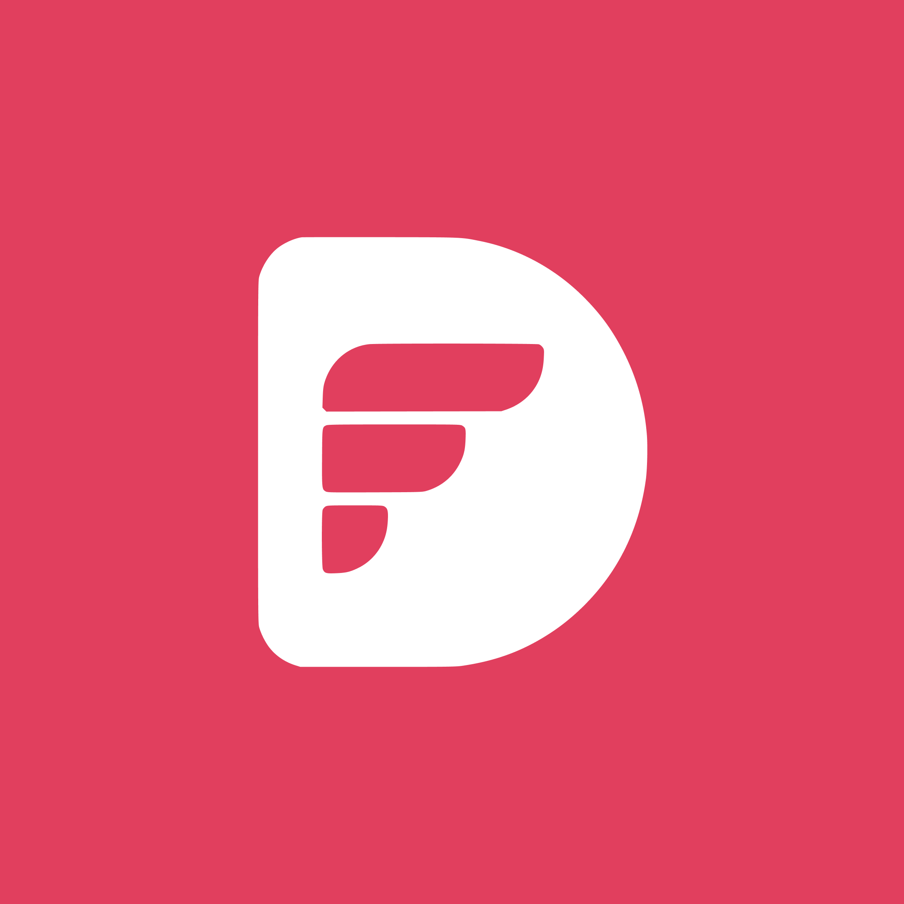
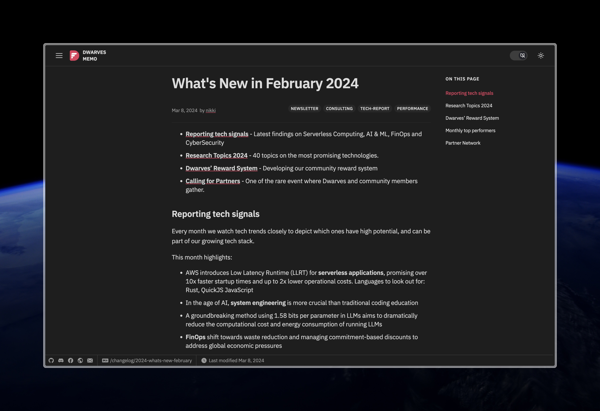

<p align="center">
  
  <h1 align="center">Dwarves Memo</h1>
  <p align="center">
    ✍ <a href="https://memo.d.foundation">https://memo.d.foundation</a> ✍
    <br/>
    The vault of knowledge where we keep our internal notes from everything related to our engineering practices, new tech we are learning, and as well as business and hiring notices
  </p>
</p>
<p align="center">
<a href="https://jetpack.io/devbox/docs/contributor-quickstart"></a>
<a href="https://twitter.com/dwarvesf"></a>
<a href="https://discord.com/invite/dwarvesv"></a>
<a href="https://www.facebook.com/dwarvesf"></a>
<a href="https://d.foundation"></a>
</p>

## About this project

This is the repository where we keep our internal notes. We use this repo to share our knowledge, insights, and experiences with each other before we make it generally available to our community.



## Getting Started

We welcome contributions from anyone who is interested in our topics. You can contribute by creating a new note, editing an existing note, or commenting on a note. To do so, you need to follow these steps:

1. Fork this repo and clone it to your local machine.
2. Install [Devbox](^9^), a command-line tool that lets you easily create isolated shells and containers for development. Devbox will help you set up a consistent and reproducible environment for this repo, with all the necessary tools and dependencies installed.
3. Run `devbox shell` in the root directory of the repo to enter an isolated shell. Alternatively, you can use [VSCode](https://code.visualstudio.com/) with the [Remote - Containers](https://marketplace.visualstudio.com/items?itemName=ms-vscode-remote.remote-containers) extension to open the repo as a devcontainer.

To run the server, you can run our Makefile command:

```sh
make watch-run
```

or through devbox:

```sh
devbox run watch-run
```

## Code of conduct

We expect all contributors to adhere to our [code of conduct](^15^), which is based on the [Contributor Covenant](https://www.contributor-covenant.org/). By participating in this project, you agree to abide by its terms. Please report any unacceptable behavior to [team@d.foundation](mailto:team@d.foundation).

## Credits

A big thank to all who contributed to this project!

If you'd like to contribute, please check out the the above Code of conduct guide.

<a href="https://github.com/dwarvesf/note.d.foundation/graphs/contributors">

</a>
