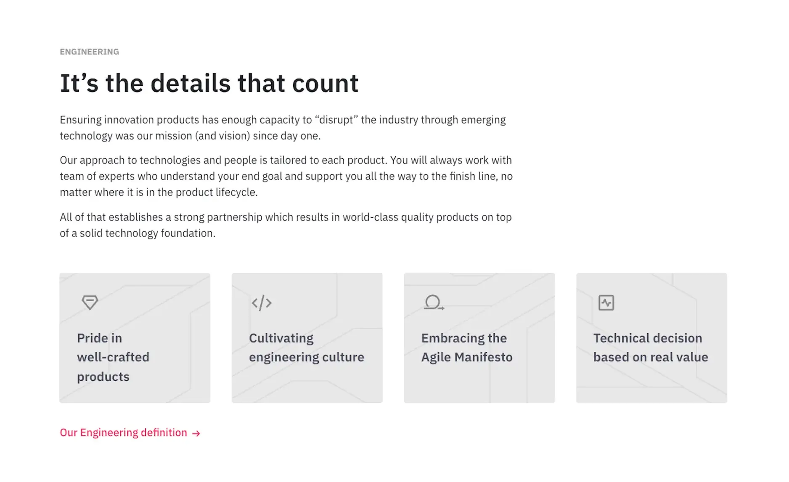
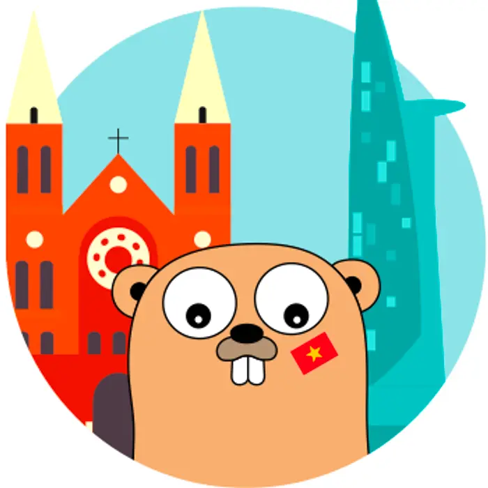
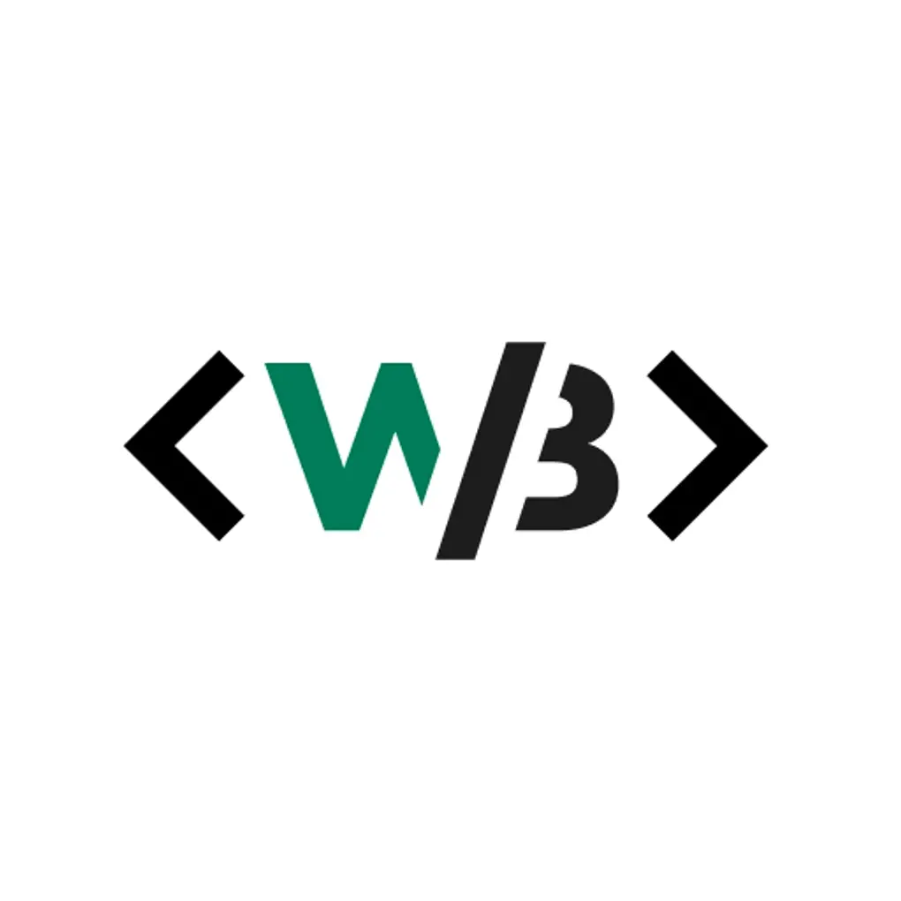
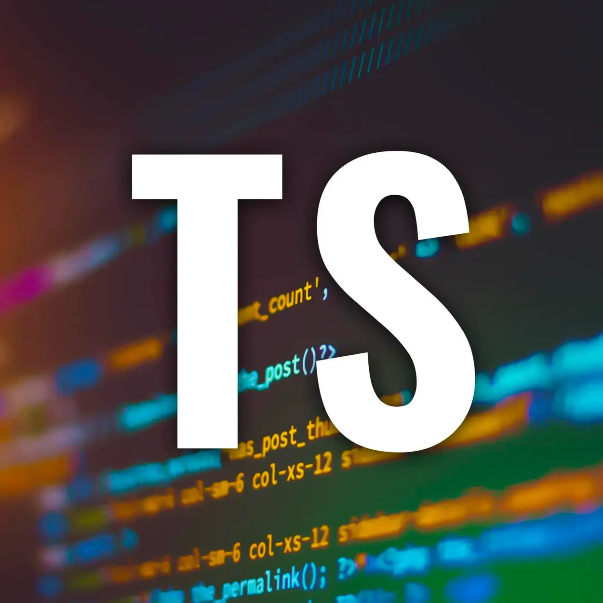

> We're like-minded teammates who pursue ambitious goals with tech culture and codes of conduct.

### Growth stories

Life at Dwarves is a series of stories about people, perspectives and lives at Dwarves.

- [Life at Dwarves: Team Hangouts](/careers/life/group/2024-10-04-life-at-df-team-hangouts)
- [Life at Dwarves: Record and reward (culture sharing)](/careers/life/group/2024-09-26-life-at-df-record-and-reward-culture-sharing)
- [Dat Nguyen](/careers/life/2024-09-26-29-dat-nguyen)
- [Life at Dwarves: H4 Supporting Hybrid Working + SOP checkin (weekly digest #14)](/careers/life/group/2024-09-23-life-at-df-hybrid-working)
- [Life cycle of a publication](/playground/01_literature/lifecycle-of-a-publication)
- [Duyen Tran](/careers/life/2024-02-19-28-duyen-tran)
- [Tri Tran](/careers/life/2024-01-22-27-tri-tran)
- [Quoc Tuan](/careers/life/2024-01-15-26-quoc-tuan)
- [Khoi Nguyen](/careers/life/2024-01-03-25-khoi-nguyen)
- [Tai Pham](/careers/life/2023-12-13-24-tai-pham)

## Build a place we love to work at

We build this company like we build a product. There are roadmaps for growth; there are phases; there are iterations. There might also be bugs, places where the company crashes because of bad organizational design, or cultural oversights.

That means we advocate for changes. Changes always start with making our people better.

### [Education allowance](https://github.com/dwarvesf/handbook/blob/master/benefits-and-perks.md#continuing-education-allowance-cea)

Annual budget for learning and development goals.

### [Referral bonus](https://github.com/dwarvesf/handbook/blob/master/benefits-and-perks.md#employee-referral-bonus)

Sponsorship to recommend peeps that fit the team.

### [Work gear supplies](https://github.com/dwarvesf/handbook/blob/master/benefits-and-perks.md#work-supplies-expense)

Team fund to back you up for work-related expenses, such as work gears or subscriptions.

### [Travel support](https://github.com/dwarvesf/handbook/blob/master/benefits-and-perks.md#flight-tickets-to-dwarves-hubs)

Annual travel package to Dwarves Hubs across the country.

### Learning sponsorship

Monthly pool for internal & external input in the team's knowledge hub.

### [Healthcare package](https://github.com/dwarvesf/handbook/blob/master/benefits-and-perks.md#annual-healthcare)

Annual Bao Minh Insurance for overall & specialized healthcare check ups.

> And other exclusive company support, as in [Dwarves Benefits & Perks]().

## Foster a learning culture

We take learning as the north-star metric. At Dwarves, we value you not only for the projects that you do for the company but also for how you strive to grow yourself. Learning at Dwarves takes place in all formats.

### [Radio talks](https://www.youtube.com/channel/UC_SyzGLf6wiqctQFsRI_frw)

Weekly sharing on practices, new findings & demos.

### [Dwarves Memo](https://memo.d.foundation)

Practice sharing, real-case demos & key takeaways.

### [Tech event](https://open.spotify.com/show/7iHr4TuMBhc2LZhLn0YFoI?si=be4abf7312fe44e1&nd=1)

Monthly sit with Vietnam tech talents for global real-world experiences.

### Lecturer training

Occasional training from university lecturers to reinforce working style & engineering mindset.

### #TIL channels

Jotted down channels for daily news & tips sharing.

## Get things done in style

We proudly ship out challenging products with the support from top-notch technology, latest toolings and frameworks. We apply Agile methodology at scale. The development phase is run in sprints, and V-model testing is applied simultaneously. Our [Dwarves Playbook](https://github.com/dwarvesf/playbook) contains teamwork ethics, engineering principles and other protocols we play by.

### [Product design](https://github.com/dwarvesf/playbook#product-design)

- [Design Sprint]()
- [AARRR Framework]()
- [UX Research]()]
- [The Design System]()

### [Production](https://github.com/dwarvesf/playbook#production)

- [Logging]()
- [Monitoring]()
- [Production Checklist]()
- [Handover Checklist]()

### [Business](https://github.com/dwarvesf/playbook#business)

- [Overall Process]()
- [Fixed Budget, Scope Controlled]()
- [Collaboration Guideline]()

### [Developing](https://github.com/dwarvesf/playbook#developing)

- [Setup](https://github.com/dwarvesf/playbook#setup)
- [Practices](https://github.com/dwarvesf/playbook#practices)
- [Platforms](https://github.com/dwarvesf/playbook#platforms)

## Community support

Driven to turn what we know into impactful products & insights for community support. Over the past few years, the Dwarves has participated in countless campaigns and become the sponsor of different tech communities.

### [Golang Vietnam](https://golang.org.vn/)

### [WeBuild Community](https://webuild.community/)

### [Techie Story](http://techiestory.net/)

### [Startup.vn](https://startup.vn/)

