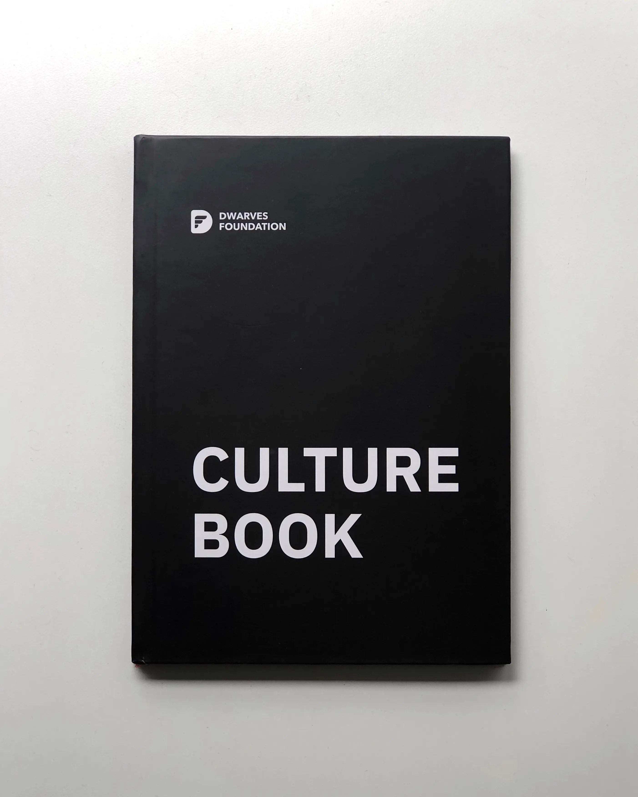

## Beyond the handbook

While our [handbook]() outlines our core values of **Craftsmanship**, **Teamwork**, and **Sustainability**, culture is more than just a document or a set of rules. It's the living, breathing essence of how we work together every day.

This collection of articles represents our ongoing exploration of what makes Dwarves culture unique. Each piece captures thoughts, experiences, and principles that have emerged from our journey building a company where engineers thrive.

## Latest from culture dir

- [The culture test](/culture/culture-test)
- [Life at Dwarves: Record and reward (culture sharing)](/careers/life/group/2024-09-26-life-at-df-record-and-reward-culture-sharing)
- [Record and reward sharing at Dwarves](/playground/notes/misc/record-reward-sharing-culture)
- [Notes on our culture](/culture)
- [Manifesto](/careers/manifesto)
- [Culture](/careers/culture)
- [OGIF - Oh God It's Friday](/updates/ogif)
- [OGIF - Oh God It's Friday](/culture/ogif-intro)
- [Red flags](/culture/red-flags)
- [Growth Is Our Universal Language](/culture/growth-is-our-universal-language)
- [Focus on delivery](/culture/focus-on-delivery)
- [Are you helping?](/culture/are-you-helping)
- [The inner circle](/culture/the-inner-circle)
- [Sharing knowledge](/handbook/community/sharing)
- [Making decision as a team member](/culture/making-decision)
- [Beyond the title](/culture/beyond-the-title)
- [Asking As A Junior](/culture/asking-as-a-junior)
- [Go the extra mile](/culture/go-the-extra-mile)
- [The Dwarves runs by ideas](/culture/runs-by-ideas)
- [A tips of hiring - Do & Don't](/culture/a-tips-of-hiring-dont)

## What you'll find here

The writings in this folder cover a range of topics:

- **Decision making and leadership** - How we distribute power, make choices, and handle responsibility
- **Team dynamics** - Building high-performing teams, providing constructive feedback, and fostering trust
- **Work approach** - Focusing on delivery, avoiding distractions, and maintaining sustainable pace
- **Personal growth** - Going beyond titles, avoiding burnout, and embracing continuous learning
- **Company culture** - Transparency, meritocracy, and creating an environment where innovation flourishes

## Culture as a Practice

Our culture isn't static. It evolves as we grow, learn, and adapt to changes in our industry and the world. These articles represent specific moments and perspectives along that journey.

We encourage everyone at Dwarves to contribute their thoughts and experiences. The best cultures are shaped by the collective wisdom and diverse perspectives of everyone involved.

## Start exploring

Browse through these articles to gain deeper insights into how we think about work, collaboration, and building software together. Whether you're a new team member or have been with us for years, there's always something new to discover about what makes our culture special.

