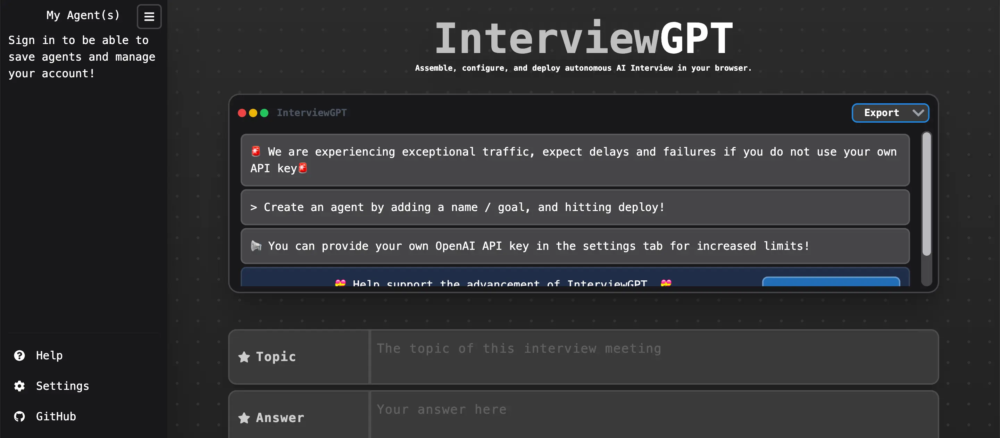

### The Idea

While ChatGPT has garnered a lot of attention over the last few months, Ngoc Thanh, our senior software engineer, has been exploring how OpenAI's API can expedite and elevate job interviews by distilling key candidate insights through an interactive chat interview. The system automatically constructs a question set based on the candidate's position, such as fresher, mid-level, or senior, to provide relevant questions based on their expertise.

The concept of InterviewGPT revolves around leveraging AI to create a website that assists engineers in interview preparation with minimal or no human involvement. Throughout the interview, candidates respond to each question, and the system uses InterviewGPT to evaluate the responses and generate follow-up questions to further assess the candidate's abilities.

### **Key features**

* The product is based on AgentGPT and works on the browser, allowing users to access and use it across multiple platforms.
* The ChatGPT-based interview system interacts with users, responds to questions, requests, and feedback in a natural manner. It can respond to and process user requests in real-time, providing an experience similar to face-to-face interviews. 

### **Technical implementation**

* Thanh used OpenAI’s API and code from AgentGPT. The implementation involves a bit of prompt engineering, crafting nuanced prompt sentences to guide ChatGPT's role as an interviewer and evaluating the candidate's answers against the learned data within ChatGPT.
* There are some common issues when using ChatGPT, such as memory limitations and API limits and the response generated by the model may not be contextual or relevant to the user's question or input. This can happen if the model is not trained properly or if the input given by the user is not clear or well-defined.
* By providing ChatGPT with access to recent and open data, as well as a way to reflect on itself, ChatGPT can provide intelligent, customized, and accurate answers to complex questions and situations. 
* The model can also be tuned and enhanced through training on new data, allowing it to continuously improve and better meet user needs over time. This helps it ensure that it generates accurate and helpful responses.

In the future, the system will incorporate additional features, including interview history storage, comprehensive evaluations of the entire process, suggestions for suitable positions and companies with active hiring needs. Furthermore, candidates will have the ability to submit their CVs for the system to automatically search for suitable positions.

Overall, the automated interview system, driven by ChatGPT, offers significant contributions towards an efficient and effective automated interview experience, fostering seamless interactions with users. 

🚀 Try InterviewGPT now: [https://interviewgpt.netlify.app/](https://interviewgpt.netlify.app/)

📩 Be a friend with us: http://discord.gg/dwarvesv

📍Discover our journey: [memo.d.foundation](http://memo.d.foundation/) 

📍Join us to work with awesome people on awesome products: [https://careers.d.foundation/](https://careers.d.foundation/) 

⚒️ Come and build with us: [https://dwarves.foundation/](https://dwarves.foundation/)
