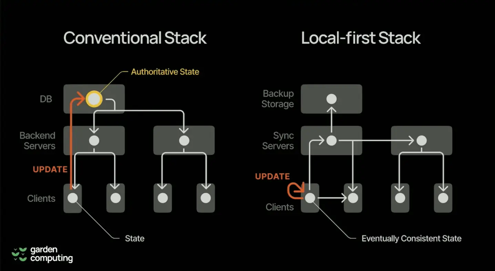

## What is Local-first Software?

Local-first software prioritizes storing data on the user's device, ensuring ownership, privacy, and offline functionality. It synchronizes with other devices and the cloud when possible, offering the benefits of cloud-based collaboration without the downsides of centralized data storage.

Let's take a quick look at how local-first compares to the conventional stack:

For a "traditional" app, the clients are a "thin" layer that depends on the servers for any read/write operations.

Local-first shifts the roles between servers and clients, making clients the primary source of data while servers act as backup and synchronization sources.

## How does it work?

Generally, local-first is enabled by two core concepts:

- **CRDTs (Conflict-free Replicated Data Types)**: These data structures allow multiple users to edit documents simultaneously, merging changes without conflicts. You can read more about CRDTs here: [Introduction to CRDT]().
- **Data Synchronization**: Changes made offline are synced with other devices and the cloud when a connection is available.

In most cases, end-to-end encryption is required to ensure data security during synchronization.

## Why local-first?

- **Data Ownership and Privacy**: Users have full control over their data, reducing the risk of breaches.
- **Offline Functionality**: Applications remain fully functional without internet connectivity.
- **Performance and Reliability**: Local data storage enhances performance and ensures reliability even with poor or no network connections.
- **Seamless Collaboration**: Enables real-time collaboration and conflict resolution without central servers.

## How does it compare to existing models?

- **Traditional File Systems and Email Attachments**: Offer local data storage but lack real-time collaboration and seamless multi-device synchronization.
- **Cloud-based Solutions (e.g., Trello, Google Drive)**: Improve accessibility and collaboration but centralize control and expose users to data breaches and loss of access.
- **Hybrid Models (e.g., Dropbox)**: Offer local storage with cloud sync but still depend on centralized servers for data availability.

## Who is using local-first?

Popular apps that are known to adopt a local-first approach:

- [**Figma**](https://figma.com/): A design tool that supports real-time collaboration with local-first principles.
- **[Obsidian](https://obsidian.md/)**: A knowledge base that stores data locally, allowing offline access and synchronization.
- **[Notion](https://www.notion.so/)**: While primarily cloud-based, it incorporates local-first elements for offline editing and data synchronization.
- **[Linear](https://linear.app/)**: A project management tool that adopts the local-first approach, ensuring data remains accessible and synchronized across devices even without an internet connection.

## What's the catch?

- **Complexity of CRDTs**: Implementing efficient and scalable CRDTs is technically challenging.
- **Security**: Ensuring robust encryption and secure data synchronization is critical.
- **User Experience**: Balancing simplicity and the benefits of local-first architecture in user interfaces.
- **Performance Overhead**: Managing the performance impact of data synchronization and CRDT operations.

## References

1. [Local-first software: You own your data, in spite of the cloud (inkandswitch.com)](https://www.inkandswitch.com/local-first/)