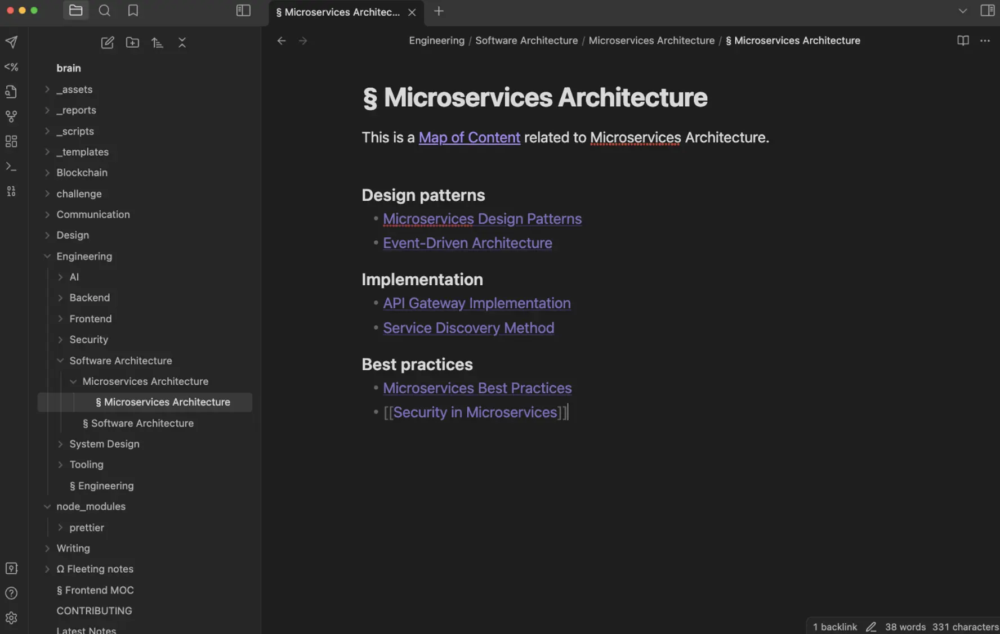
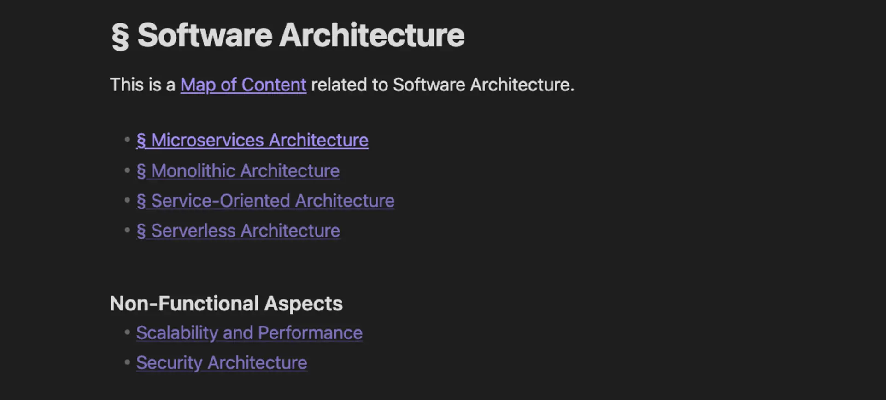

This memo explains how to create a Map of Content (MOC) for our knowledge hubs. The concept was introduced by Nick Milo, who also runs courses on [Linking Your Thinking](https://www.linkingyourthinking.com/learn-more).

## **What is a MOC?**

A Map of Content (MOC) is a note that acts like a map, pointing to other notes within a knowledge base. It serves as an active index, providing a high-level view of interconnected notes. Unlike a folder, an MOC isn't confined to one location. It offers a flexible and connected way to organize notes, making it easier to think and link ideas.

## **When to use an MOC**

Knowing when to create an MOC is crucial for effective project and idea management. Here are some situations where an MOC is especially useful:

1. **When you feel overwhelmed:** If our notes feel scattered and hard to manage, it's time to create an MOC. This helps organize and impose order on your notes.
2. **When starting a new topic:** Begin a new topic with an MOC to map out all notes and resources. This allows us to see the scope and relationships from the start.

## **Why Use a MOC**

MOCs offer several advantages:

- **Reduces Overwhelm:** Organizes notes to ease anxiety and prevent slowdowns.
- **Encourages Ideation:** Promotes rapid idea development and interaction.
- **Enhances Navigation:** Simplifies finding and recalling information.
- **Supports Scalability:** Grows with thoughts, enhancing understanding.
- **Flexibility:** Provides a non-restrictive way to organize and link information.

## **How to Create a MOC**

Creating a Map of Content (MOC) doesn't follow a strict formula, but here is a general guideline:

**1. Identify Core Topic**

Start with a central theme. For example, "_Microservices Architecture_."

**2. Make MOC Note**

Create a new note titled "_§ Microservices Architecture_" in your note-taking tool. The **`§`** symbol helps sort the note to the top of your folder and indicate it is a MOC note.

Every topic folder should have a corresponding MOC. If there are multiple MOCs, create a home MOC helps with navigation for readers and contributors.

**3. Gather Related Notes**

If it’s a new topic, proceed to the next step. Otherwise, include all related notes, documents, and resources. Link these to the core topic. For example:

- `[[Microservices Design Patterns]]`
- `[[API Gateway Implementation]]`
- `[[Event-Driven Architecture]]`
- `[[Service Discovery Methods]]`
- `[[Security in Microservices]]`
- `[[Microservices Best Practices]]`

**4. Add Context and Categories**

Organize the links into categories or sections, adding brief descriptions for context. Arrange the content from basic to advanced, addressing what, why, when, and how:

- **What**: Introduction, history
- **Why**: Reasons, benefits, applications
- **When**: Best practices, pros and cons
- **How**: Mechanisms, key techniques

Example:

- **Design Patterns:**
  - `[[Microservices Design Patterns]]`
  - `[[Event-Driven Architecture]]`
- **Implementation:**
  - `[[API Gateway Implementation]]`
  - `[[Service Discovery Methods]]`
- **Best Practices:**
  - `[[Microservices Best Practices]]`
  - `[[Security in Microservices]]`

**5. Iterate and Expand**

Continuously grow the MOC with new information and insights. Add new links, refine categories, and keep it a living document.

**6. Cross-Link MOCs**

Link various MOCs together. For example, the "_§ Microservices Architecture_" might link to a broader "_§ Software Architecture_."

## **Conclusion**

A Map of Content (MOC) structure is a valuable tool for managing information. At Dwarves, we strive to create content that contributes meaningfully to the tech community while supporting our engineering team's collective knowledge. By developing and sharing well-crafted MOCs, we aim to maintain our standards and ensure that our insights remain accessible and useful to our audience.
