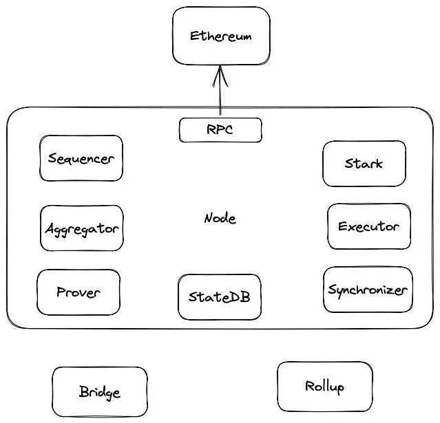
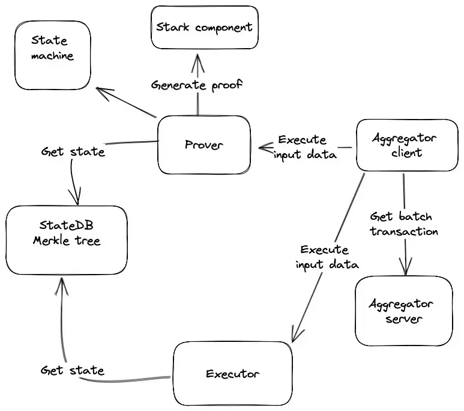
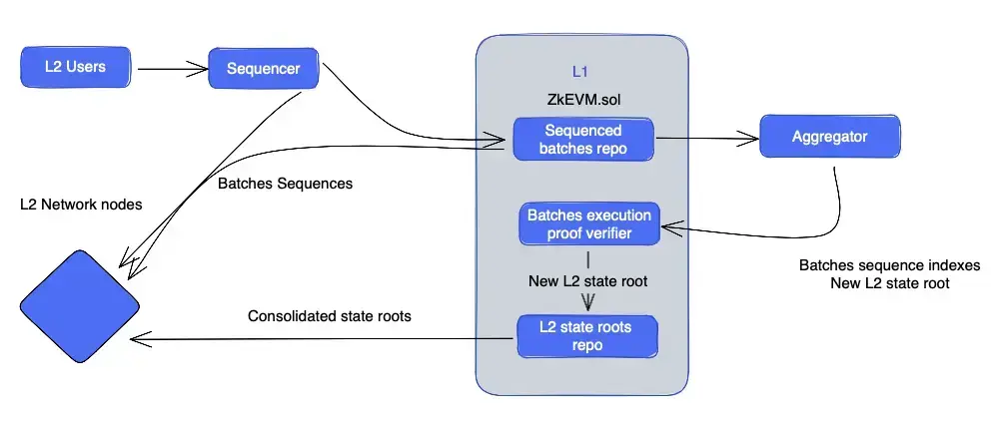
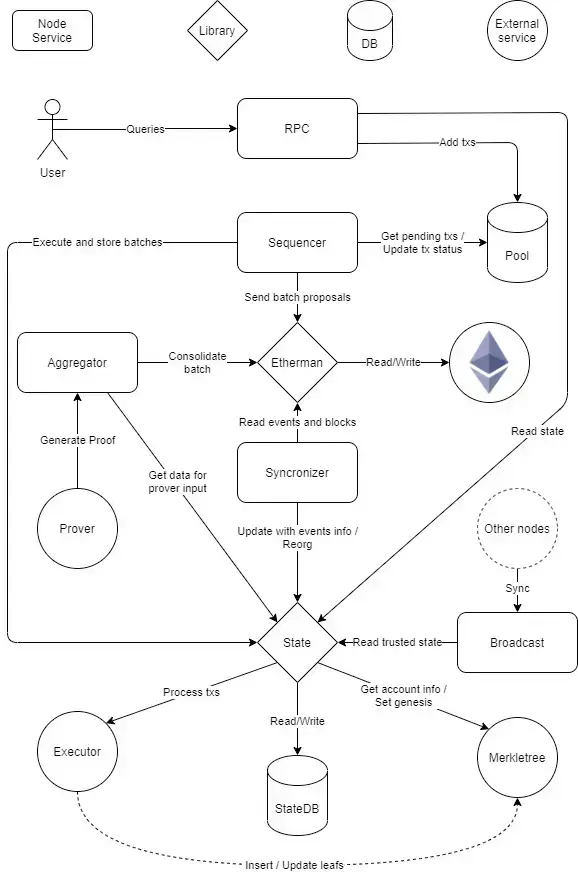

<!-- table_of_contents adbd9b7d-46a4-4a1f-ab90-ce4abf276231 -->

_At Dwarves, we are currently working on creating a bridge token in one of our blockchain projects. With more recent concerns on privacy and security, we wanted to understand how we could move tokens across blockchains without needing to know any other information about the transaction. This has motivated our research on Zero-Knowledge proofs and their possible applications for bridges._

## Introduction

Blockchain technology has revolutionized the way we think about trust and decentralization, enabling the creation of secure and transparent systems without the need for intermediaries. However, the scalability limitations of many blockchain networks have become a major obstacle to their widespread adoption. To address this issue, a new approach has emerged: layer 2 solutions built on top of existing blockchain networks.

## Approaching Blockchain Layer 2

Blockchain layer 2 is being used to build applications that require high performance at reasonable costs, such as decentralized exchanges, supply chain management systems, decentralized gaming, and decentralized asset management. In this article, we will focus on the architecture design of a layer 2 blockchain. This approach involves aggregating multiple transactions into a single transaction proof, which is then validated on the main blockchain, allowing for a significant increase in throughput. We will focus on the design system for layer 2 using ZK rollup, with a particular emphasis on the Zero-Knowledge Ethereum Virtual Machine (zkEVM) and its various components.

## Zero-Knowledge **Ethereum Virtual Machine** (zkEVM)

The overall design of zkEVM follows the State Machine model and, therefore, **emulates the Ethereum Virtual Machine (EVM)** with the aim of providing the same user experience as Ethereum. In addition to enabling ERC20 token payments and transfers, users can now run Ethereum smart contracts on it.

The aggregate strategy is to**develop a zkProver**that executes a series of multiple transactions, proves their validity, and publishes only the minimum size valid proof for verification. This reduces transaction completion times and saves gas costs for Ethereum users.

However, zkEVM is not just a compilation but a zero-knowledge compilation. Its design utilizes the most famous techniques in ZK folklore while introducing novel ZK tools. One example of such tools is the new Polynomial Identification Language (PIL), which plays a key role in enabling zkProver to generate verifiable proofs.

State machines are best suited for repetitive deterministic computations, which are common in Ethereum. In contrast, arithmetic circuits will need unrolled loops and thus lead to undesired larger circuits.


## System Requirements

Since this isn’t a closed system, there are few requirements we need to meet in order to ensure its security, performance, and workability. The following are the essential requirements for a blockchain layer 2 system that we should have:

- Compatible with applications, platforms, and technologies ... that already working with the Ethereum network (Block, EVM)
- Scalability of computation speed, transaction validation, proof building. The time to create a batch is optimized according to the network throughput of layer 2 (If the number of transactions / second increases, it is necessary to reduce the block time)
- Data availability: data is saved off-chain, the proof is saved on-chain, and transaction information can be saved via call-data
- Optimizing on-chain storage cost and size through reducing proof size, saving data in call-data
- The system is towards decentralized as many components as possible such as Sequencer, Prover

## Approach to solving the requirements

In order to meet our system requirements, we are essentially creating a **zkProver**. The general approach to designing zkProver to realize a proof system based on State Machines is as follows:

- Turn the necessary deterministic computation into **state machine computation**.
- Describe state transitions according to **algebraic constraints**. These are like rules that every state transition must meet.
- Use **interpolation** state values to build state machine description polynomials.
- Define **polynomial identity** to which all state values must satisfy.
- A specially designed **cryptographic proof** system (e.g. STARK, SNARK, or a combination of both) is used to generate verifiable proof that anyone can Verification.

## Design the system

### System Overview

Similar to other blockchains, the system will include the main components of a regular blockchain. The difference in layer 2 will be that the calculation of the smart contract will be processed off-chain by specialized machines to improve processing speed, the calculation results will be verified by a separate algorithm and saved on layer 1. The system architecture of Layer 2 ZK-EVM consists of four primary components: the blockchain node, client, ZK-rollup smart contract, and the Ethereum bridge.

The Aggregator is responsible for aggregating and compressing user transactions into a single proof, which is then validated by the ZKProver and submitted to the Ethereum network via the Ethereum bridge. The Rollup smart contract is deployed on the Ethereum network and handles the creation and management of layer 2 transactions. The Ethereum bridge connects the layer 2 and layer 1 networks, enabling the transfer of assets between the two networks.



## Components

The main components we need for the layer 2 system (that also include components of a regular blockchain) includes:

- Blockchain Node
- **Sequencer** - a type of rollup node that is responsible for collecting transactions and producing new blocks.
- **ZkProver** - a prover and verifier of transactions using zkEVM and state machines
- **RPC**- Remote Procedure Call holding set of protocols and interfaces that to access the blockchain
- **Synchronizer** - helps nodes to stay up-to-date with the latest state on the blockchain
- **ZK SNARK/STARK**- arguments of knowledge to prove transactions without revealing any information
- **StateDB**- a database to store current states of all accounts and contracts on the Ethereum network
- **Ethereum Bridge** - a mechanism to transfer assets between 2 blockchain networks
- **ZKRollup smart contract**- a smart contract that takes hundreds of transactions off the main blockchain and bundles them into a single transaction, to then send a validity proof to the main blockchain

### ZkProver Component

The proof and verification of transactions in Polygon zkEVM are both handled by a zero-knowledge proofing component called zkProver. All the rules for a valid transaction are implemented and executed in zkProver. Prover relies on the transactions to be processed, and the state of the network to calculate the proof. zkProver mainly interacts with two components i.e. Node and Database (DB). Therefore, before diving deeper into other components, we must understand the control flow between zkProver, Node and Database. Here is a diagram to explain the process clearly.



- Prover executes input data, calculates the result state, and generates proof. It calls the Stark component to generate proof of the Executor state machine committed polynomials.
- Key components of zkProver for generating verifiable proof:
- The executor is the main state machine executor
- STARK recursive component
- CIRCOM library
- Prove ZK-SNARK

### State machine Component


_[https://docs.hermez.io/zkEVM/zkProver/State-Machines/Overview/figures/fig-actions-sec-sm.png](https://docs.hermez.io/zkEVM/zkProver/State-Machines/Overview/figures/fig-actions-sec-sm.png)_

The system uses state machines with transactions with inputs transactions, the old and new state, sequencer’s chainID:

- Main state machine executor
- Secondary state machine
- Binary SM
- Memory SM
- Storage SM
- Poseidon SM
- Keccak SM
- Arithmetic SM

### Aggregator Component

The Aggregator client connects to the Aggregator server and calls Prover to generate the proof of the calculation

### Executor Component

Executors execute input data and calculate the resulting state, but they do not generate proof. They provide a fast way to check whether the proposed batch is properly built and whether the amount of work that can be proven fits in a single batch.

### StateDB Component

StateDB plays an important role in ensuring the integrity and reliability of the blockchain. StateDB provides a single source of state, storing the state of the system in a database. It ensures that every node on the network can synchronize with the current state of the blockchain and confirm the validity of newly added transactions. Additionally, StateDB is used to determine access rights and permissions for each account and smart contract on the blockchain.

### L2 State

Design to update L2 State over time so that the state is always the most properly synchronized over time. There are three stages of the L2 State, each of which corresponds to three different ways that L2 nodes can update their state. All three cases depending on the format of the batch data used to update the L2 State.

- In the first case, the update is only notified by information (i.e. the Lot consisting of sorted transactions) coming directly from the Trusted Sequencer, before any data is available on L1. The resulting L2 state is called the Trusted state.
- In the second case, the update is based on the information obtained by the L2 nodes from the L1  network. After the plots have been sequenced and data have been made available on L1. The L2 state is called  Virtual State at this time.
- The information used to update L2 State in the final case includes verified zero-knowledge proofs of computational integrity. After the Zero-Knowledge proof has been successfully verified in L1, L2 nodes synchronize their local L2 State root with the root committed in L1 by the Trusted Aggregate trust. As a result, such L2 State is called  Unified State

### Sequencer Component

Trusted Sequencer generates batches, but to achieve quick results of L2 transactions and avoid having to wait for the next L1 block, they are shared with L2 network nodes via a streaming channel. Each node will run batches to compute local L2 state results.

Once the Trusted Sequencer has committed the batch chains fetched directly from L1, the L2 network nodes will re-execute them and they will no longer have to trust it.

Execution of off-chain batches will eventually be verified on-chain via Zero-Knowledge proof and the resulting L2 state root will be committed. As the zkEVM protocol evolves, new L2 state roots will be synchronized directly from L1 by the L2 network nodes.



### Bridge Component

The bridge is responsible for receiving and processing requests to transfer information across different blockchain networks. For example, the user wants to send ETH from the Ethereum network to the layer 2 blockchains, the user will send a request to a smart contract on Ethereum or smart contract on layer 2, Aggregator will listen for pre-registered events for processing. You can follow the diagram below:


- The bridge client creates a request to deposit or claim to Ethereum or zkEVM node (layer 2) to start transferring the token
- The Aggregator will sync events with Ethereum and store bridge events to Bridge DB and update the Merkle tree root
- The zkEVM node sync bridge event with Aggregator

### Smart contract

The smart contract is used to execute the proof of layer 2 in layer 1, transfer assets between layers, and store proof and root Merkle Tree. In this case, we can learn from zkEVM smart contract:

- Smart contract [Bridge.sol](https://github.com/0xPolygonHermez/zkevm-contracts/blob/main/contracts/PolygonZkEVMBridge.sol):

The main functions:

- **bridgeAsset**: transfer token from L1 to L2, add leaf to Merkle tree, emit event
- **bridgeMessage**: transfer message in bytes format that executable
- **claimAssert**: verify Merkle proof and withdraw tokens/ether
- **claimMessage**: Verify Merkle proof and execute message
- Smart contract [GlobalExitRoot.sol](https://github.com/0xPolygonHermez/zkevm-contracts/blob/main/contracts/PolygonZkEVMGlobalExitRoot.sol)
- **updateExitRoot**: Update the exit root of one of the networks and the global exit root
- **getLastGlobalExitRoot**: Return last global exit root
- Smart contract [GlobalExitRootL2.sol](https://github.com/0xPolygonHermez/zkevm-contracts/blob/main/contracts/PolygonZkEVMGlobalExitRootL2.sol)
- **updateExitRoot**: Update the exit root of one of the networks and the global exit root
- Smart contract [zkEVM.sol](https://github.com/0xPolygonHermez/zkevm-contracts/blob/main/contracts/PolygonZkEVM.sol)
- **sequenceBatches**: Allows a sequencer to send multiple batches
- **verifyBatches**: Allows an aggregator to verify multiple batches
- **trustedVerifyBatches**: Allows an aggregator to verify multiple batches
- **sequenceForceBatches**: Allows anyone to sequence forced Batches if the trusted sequencer do not have done it in the timeout period

### RPC

RPC (Remote Procedure Call) is a JSON-RPC interface compatible with the Ethereum network. In order for a software application to interact with the Ethereum blockchain (by reading blockchain data and/or sending transactions to the network), that application must connect to an Ethereum node. RPC allows the integration of zkEVM with existing tools, such as Metamask, Etherscan, and Infura. It adds transactions to the Pool and interacts with the State using read-only methods. It allows interaction with the blockchain through methods similar to EVM.

### Final Node component diagram

One node will include all the components as we have shown above. the components will be started and run simultaneously as a whole



The diagram represents the main components of the software and how they interact between them. Note that this reflects a single entity running a node, in particular a node that acts as the trusted sequencer. But there are many entities running nodes in the network, and each of these entities can perform different roles.

### Transaction Flow

**Submit transaction**
Transactions in the zkEVM network are generated in the user's wallet and signed with their private key. Once created and signed, transactions are sent to the Trusted Sequencer node through their JSON-RPC interface. The transactions are then stored in the pending transaction pool, where they await the Sorter's selection to execu`te or discard.

**Transactions and Blocks on zkEVM**
In the current design,  a single transaction is equivalent to a block. This design strategy not only improves RPC and P2P communication between nodes but also enhances compatibility with the existing engines and facilitates rapid completion in L2. It also simplifies the process of locating user transactions.

**Execute transaction**
Trusted Sequencer reads transactions from the pool and decides whether to cancel them or sort and execute them. The executed transactions are added to a batch of transactions and the Local L2 State of the Sequencer is updated.

After a transaction is added to the L2 State, it is broadcast to all other zkEVM nodes via the broadcast service. It is worth noting that by relying on Trusted Sequencer, we can reach the final transaction quickly (faster in L1). However, the resulting L2 State will remain in a trusted state until the batch is committed in the Consensus Contract.

**Batch transaction**
Trusted Sequencer must batch execute transactions using the following BatchData structure specified in the PolygonZkEVM.sol contract:

```solidity
struct BatchData {
  bytes transactions;
  bytes32 globalExitRoot;
  uint64 timestamp;
  uint64 minForcedTimestamp;
}
```

**Transactions**
These are byte arrays containing concatenated batch transactions. Each transaction is encrypted in the Ethereum pre-EIP-115 or EIP-115 format using the RLP (Recursive-length prefix)  standard, but the signature values,  `v`, and `s`, are concatenated;

**Batch sequencing**
Plots need to be sequenced and validated before they can become part of the L2 Virtual State.

Trusted Sequencer has successfully added a batch to a sequence of batches using the  L1 PolygonZkEVM.sol contract `sequencedBatches` map, which is essentially a  storage structure containing a queue of processes self-defined Virtual State.

```solidity
// SequenceBatchNum --> SequencedBatchData
mapping(uint64 => SequencedBatchData) public sequencedBatches;
```

The batches must be part of an array of batches that are ordered sequentially. The Trusted Sequencer calls Contract PolygonZkEVM.sol, which uses the sequenceBatches mapping, which accepts an ordered array of batches as an argument. Please see the code snippet provided below.
