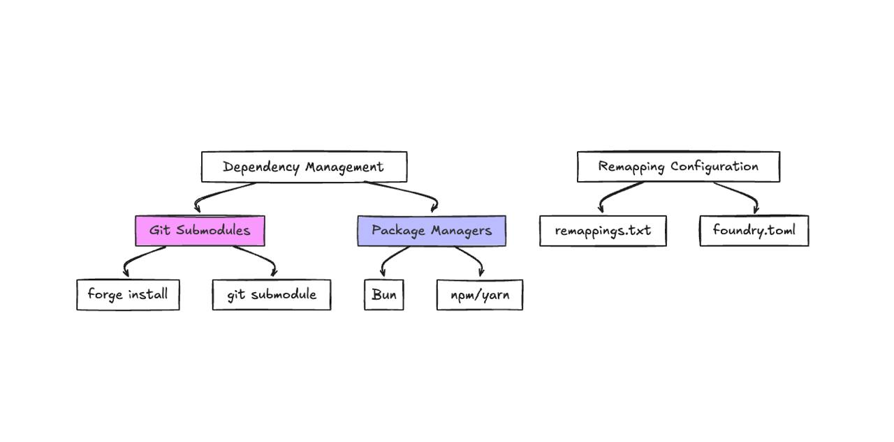
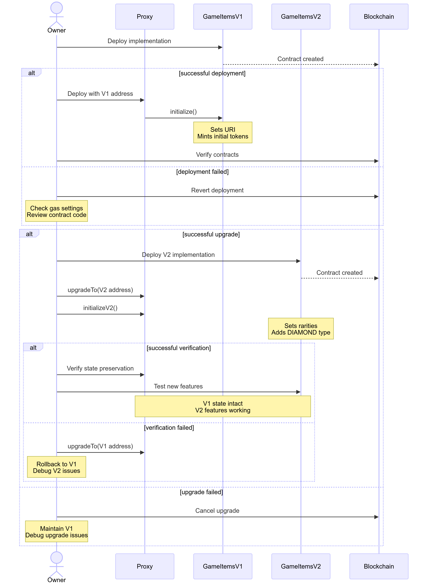

## Overview of Foundry

Foundry is a blazingly fast, portable, and modular toolkit for Ethereum application development written in Rust. It consists of three main components:

- **Forge**: Testing framework for Ethereum smart contracts
- **Cast**: Swiss army knife for interacting with EVM smart contracts
- **Anvil**: Local Ethereum node designed for development


## Why others not using Hardhat?

Foundry's Rust-based architecture makes testing much faster than JavaScript alternatives. Security teams and auditors prefer working directly in Solidity without translation layers. The framework's adoption has grown quickly in 2024, especially for high-value contracts where performance and reliability matter.

Foundry's terminal-based workflow cuts out JavaScript overhead, making it perfect for developers who want to work closer to the metal. Security teams love its deterministic environment when dealing with complex contracts.


## Why we not using Hardhat?

Hardhat's lack of ESM support in TypeScript projects forced us to use outdated CommonJS modules. Since our frontend and services already use ESM, this created unnecessary friction in our development workflow. Foundry's language-agnostic approach lets us maintain a consistent ESM-based architecture across our entire stack.

## Core benefits of Foundry

**Development Speed**: Foundry accelerates development through fast compilation, native Solidity testing, and quick feedback loops, with benchmarks showing it's consistently 1.5-11x faster than Hardhat and up to 335x faster than Dapptools.

The platform offers **Modern Developer Experience** with built-in fuzzing that can run 10,000 tests in seconds to find edge cases, powerful debugging tools for precise error identification, and comprehensive gas optimization features that help create efficient contracts.

For **Flexibility**, Foundry seamlessly integrates with existing toolchains while supporting multiple EVM chains through its comprehensive toolkit consisting of Forge (for testing), Cast (for contract interaction), and Anvil (local Ethereum node), making it adaptable to various project requirements and easily incorporated into CI/CD pipelines for automated testing and deployment.

In our projects, we've seen these benefits firsthand. Our team uses Foundry's fast testing to catch issues early in development, while the native Solidity testing helps us write more accurate tests. The gas optimization features have helped us reduce deployment costs by up to 30% in some cases. We particularly value the deterministic environment when working on complex DeFi contracts where every gas optimization matters.

## What we actually do?

### Dealing with dependencies and remapping



#### Git Submodules (Traditional Approach)

```bash
forge install OpenZeppelin/openzeppelin-contracts --no-commit
git submodule update --init --recursive
```

#### Modern package management with Bun

```bash
bun init
bun add -d @openzeppelin/contracts
```

Configure remappings in `remappings.txt`:

```text:remappings.txt
@openzeppelin/=node_modules/@openzeppelin/
ds-test/=lib/forge-std/lib/ds-test/src/
forge-std/=lib/forge-std/src/
```

### Deploying and testing a Smart Contract

We'll build an upgradeable ERC-1155 contract for game items (GOLD, SILVER, SWORD, SHIELD) using Foundry. This example shows how to:

- Implement and test smart contracts
- Set up deployment scripts
- Handle contract upgrades using the UUPS upgrade pattern

#### Implement a basic ERC-1155 contract

First, let's create an upgradeable ERC-1155 contract:

```solidity:src/GameItems.sol
// SPDX-License-Identifier: MIT
pragma solidity ^0.8.13;

import "@openzeppelin/contracts-upgradeable/token/ERC1155/ERC1155Upgradeable.sol";
import "@openzeppelin/contracts-upgradeable/access/OwnableUpgradeable.sol";
import "@openzeppelin/contracts-upgradeable/proxy/utils/Initializable.sol";
import "@openzeppelin/contracts-upgradeable/proxy/utils/UUPSUpgradeable.sol";

contract GameItems is Initializable, ERC1155Upgradeable, OwnableUpgradeable, UUPSUpgradeable {
    // Item IDs
    uint256 public constant GOLD = 0;
    uint256 public constant SILVER = 1;
    uint256 public constant SWORD = 2;
    uint256 public constant SHIELD = 3;

    /// @custom:oz-upgrades-unsafe-allow constructor
    constructor() {
        _disableInitializers();
    }

    function initialize() public initializer {
        __ERC1155_init("https://game.example/api/item/{id}.json");
        __Ownable_init();
        __UUPSUpgradeable_init();

        // Mint initial items
        _mint(msg.sender, GOLD, 10**18, "");
        _mint(msg.sender, SILVER, 10**27, "");
        _mint(msg.sender, SWORD, 1000, "");
        _mint(msg.sender, SHIELD, 1000, "");
    }

    function mint(address account, uint256 id, uint256 amount)
        public
        onlyOwner
    {
        _mint(account, id, amount, "");
    }

    function _authorizeUpgrade(address newImplementation)
        internal
        onlyOwner
        override
    {}
}
```

#### Writing tests for our contract

Create comprehensive tests for the contract:

```solidity:test/GameItems.t.sol
// SPDX-License-Identifier: UNLICENSED
pragma solidity ^0.8.13;

import "forge-std/Test.sol";
import "../src/GameItems.sol";
import "@openzeppelin/contracts/proxy/ERC1967/ERC1967Proxy.sol";

contract GameItemsTest is Test {
    GameItems public implementation;
    GameItems public gameItems;
    address public owner;
    address public user1;

    function setUp() public {
        owner = address(this);
        user1 = address(0x1);

        // Deploy implementation
        implementation = new GameItems();

        // Deploy proxy
        bytes memory initData = abi.encodeWithSelector(
            GameItems.initialize.selector
        );
        ERC1967Proxy proxy = new ERC1967Proxy(
            address(implementation),
            initData
        );
        gameItems = GameItems(address(proxy));
    }

    function testInitialBalance() public {
        assertEq(gameItems.balanceOf(owner, gameItems.GOLD()), 10**18);
        assertEq(gameItems.balanceOf(owner, gameItems.SILVER()), 10**27);
        assertEq(gameItems.balanceOf(owner, gameItems.SWORD()), 1000);
        assertEq(gameItems.balanceOf(owner, gameItems.SHIELD()), 1000);
    }

    function testMinting() public {
        gameItems.mint(user1, gameItems.GOLD(), 100);
        assertEq(gameItems.balanceOf(user1, gameItems.GOLD()), 100);
    }

    function testFailMintingUnauthorized() public {
        vm.prank(user1);
        vm.expectRevert("Ownable: caller is not the owner");
        gameItems.mint(user1, gameItems.GOLD(), 100);
    }

    function testBatchTransfer() public {
        uint256[] memory ids = new uint256[](2);
        ids[0] = gameItems.GOLD();
        ids[1] = gameItems.SILVER();

        uint256[] memory amounts = new uint256[](2);
        amounts[0] = 100;
        amounts[1] = 200;

        gameItems.safeBatchTransferFrom(
            owner,
            user1,
            ids,
            amounts,
            ""
        );

        assertEq(gameItems.balanceOf(user1, gameItems.GOLD()), 100);
        assertEq(gameItems.balanceOf(user1, gameItems.SILVER()), 200);
    }
}
```

#### Add a deployment script

Create a deployment script that handles both the implementation and proxy deployment:

```solidity:script/GameItems.s.sol
// SPDX-License-Identifier: UNLICENSED
pragma solidity ^0.8.13;

import "forge-std/Script.sol";
import "../src/GameItems.sol";
import "@openzeppelin/contracts/proxy/ERC1967/ERC1967Proxy.sol";

contract GameItemsScript is Script {
    function run() public {
        uint256 deployerPrivateKey = vm.envUint("PRIVATE_KEY");

        vm.startBroadcast(deployerPrivateKey);

        // Deploy implementation
        GameItems implementation = new GameItems();

        // Prepare initialization data
        bytes memory initData = abi.encodeWithSelector(
            GameItems.initialize.selector
        );

        // Deploy proxy
        ERC1967Proxy proxy = new ERC1967Proxy(
            address(implementation),
            initData
        );

        // Log addresses
        console.log("Implementation deployed to:", address(implementation));
        console.log("Proxy deployed to:", address(proxy));

        vm.stopBroadcast();
    }
}
```

#### Run the deployment

```bash
# Deploy to local network
forge script script/GameItems.s.sol --fork-url http://localhost:8545 --broadcast

# Deploy to testnet (e.g., Sepolia)
forge script script/GameItems.s.sol \
    --rpc-url $SEPOLIA_RPC_URL \
    --broadcast \
    --verify \
    -vvvv
```

#### Contract Lifecycle: From Development to Deployment



## Limitations

While Foundry shines in performance, it has its drawbacks. The lack of multi-network config files makes cross-chain deployments more tedious than Hardhat. The debugging tools, though functional, can't match Truffle's step-by-step debugger. We've also felt the smaller plugin ecosystem - you'll often need to build custom tooling that would be readily available in Hardhat.

Writing tests in Solidity instead of JavaScript creates a steeper learning curve, especially for web developers on our team. The docs are improving but still leave gaps around advanced features, and community resources are still catching up to Hardhat's mature ecosystem.

## Our assessment

After months of wrestling with Hardhat's ESM limitations in our TypeScript stack, switching to Foundry was a game-changer. Sure, rewriting our JavaScript tests in Solidity took time, and we missed some familiar plugins. But the payoff was worth it - our test suite now runs in 40 seconds instead of 7 minutes.

Writing tests in Solidity turned out to be a blessing in disguise. It eliminated translation errors and made our tests more precise. For teams ready to invest in learning Foundry, it offers a rock-solid foundation that pays off in both development speed and contract quality.
