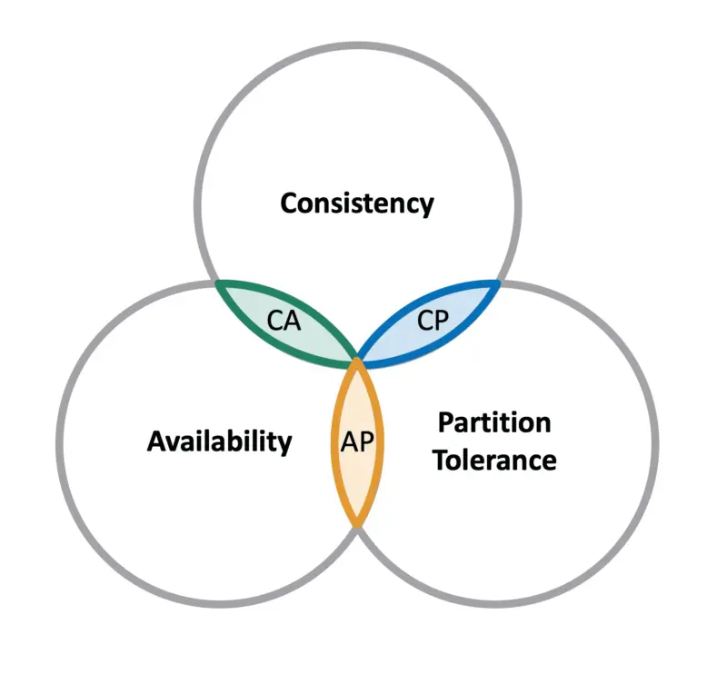

## What is CAP theorem

CAP theorem, or also named Brewer's theorem (from scientist Eric Brewer), states that any distributed data store can provide only two of three guarantees:

- **Consistency:** Any read operations are up-to-date with the latest write operation, meaning that all clients see the same data at a given point of time.
- **Availability:** In a distributed data store, any and all working nodes in the system should return a valid response for any request, without exception.
- **Partition tolerance**: This refers to tolerance for an event that causes a network or power disturbance between 2 or more nodes. Tolerance here means that the cluster should continue to work despite drops in communication between nodes.

## CAP theorem database types

- **CP database:** A CP database sacrifices availability for consistency and partition tolerance. In a network partition, non-consistent nodes are shut down until the partition is resolved.
- **AP database:** An AP database delivers availability and partition tolerance at the cost of consistency. In a network partition, read consistencies occur between nodes, such that clients accessing one node may see different data than other clients. This inconsistency occurs until the partition is resolved, in which case the system will try to re-sync all nodes to repair all inconsistencies.
- **CA database:** A CA database achieves consistency and availability across all nodes. In a network partition, request for data will not return a valid response, as any partition will mean a loss of consistency. As such, such a database is not fault-tolerant.

## In reality

Eric Brewer makes it a point that you can only have 2 out of 3 guarantees in CAP theorem, which is not completely true. You can ensure at least a subset of guarantees between all three parts of the CAP theorem. There will always be nuanced tradeoffs in such a rounded approach to a distributed data store.

#### Reference

- https://en.wikipedia.org/wiki/CAP_theorem
- https://www.ibm.com/cloud/learn/cap-theorem
