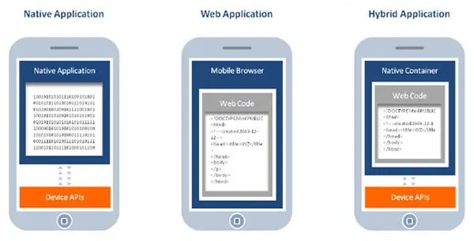
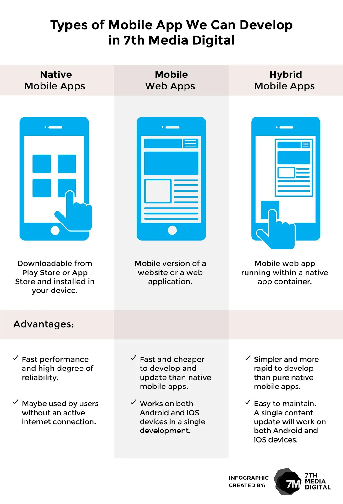
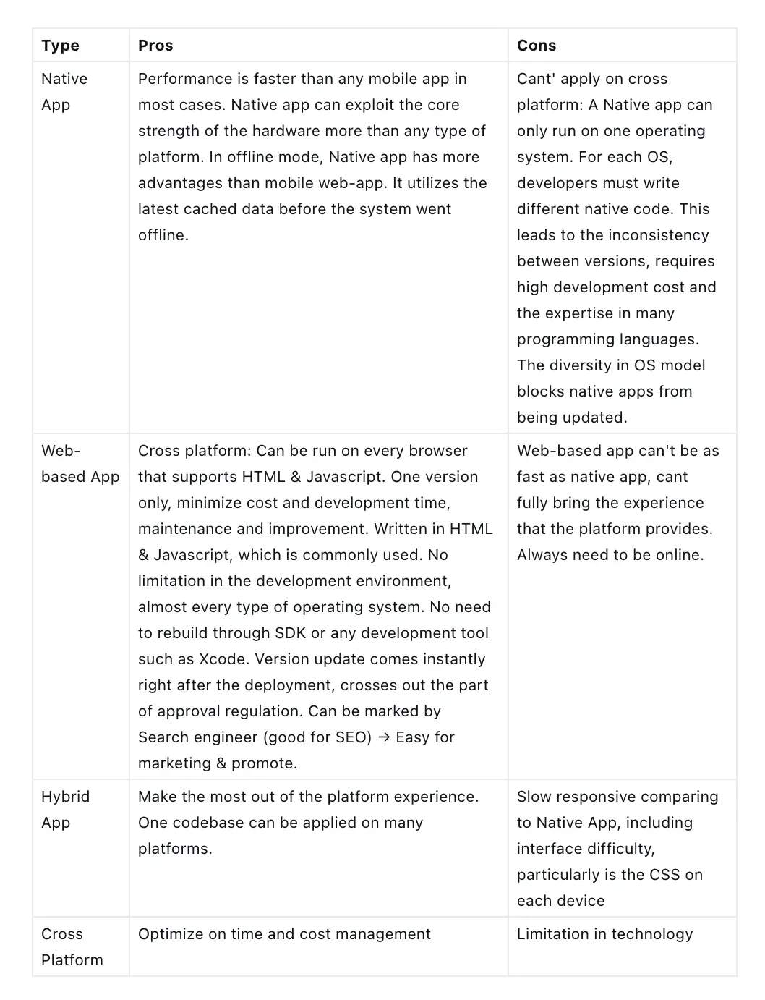

This workshop wraps up the useful information on 2 types of operating system for UX/UI designers, based on the personal research on iOS and Android. The purpose is to create an application that brings comfortability and a great experience to the end user.

## Introduction to iOS & Android

### Adjustment & Privacy

- iOS has better privacy protection since it belongs exclusively to iOS, but this leads to the limitation of function adjustment.
- Android uses an open source code, so it can be adjusted and modified as needed. This is called AOSP (Android Open Source Project)

### Hardware

- iOS can optimize the hardware and stabilize its platform, and its application has great compatibility with the devices in the ecosystem
- Android: Smartphones of Android usually get lagged during the using process. The home screen may get frozen and cannot respond to the request.

### Performance

- iOS manages RAM better, so the performance is fast and barely has any error
- Android: The performance is slow easy to get config that causes errors

### Application Upload on Appstore/ CH Play

- iOS takes more time to upload: 7 days on average due to personal expert verification
- Android takes less time to upload thanks to automated test

### Version Updates

- iOS: Update version can be instantly updated for every iOS model, which makes it convenient for every device of the iOS ecosystem (iPhone, iPad, Macbook): convenient in file synchronization, upload photos from iCloud to other devices; Airdrop between iOS & iOS, receive desktop notification for incoming calls, text messenger,…
- Android: Updates on Android usually take more time (due to the diversity of hardware), not to mention some old models can be skipped for version update. This may refer to the strategy of up-sell, people feel the need to purchase the new model once the old one can't be updated.

### Language

- iOS: supports over 100 languages (due to the diversified nationality of users)
- Android: 34 languages

### Development Environment

- iOS: Xcode
- Android: Android studio

The invention of studio later that supports developer to code on cross platform, therefore the coding process no longer needs to be divided into 2 types of platform.

### Programmed in

- iOS: C, C++, Java
- Android: Objective C, C++

### Open Source

- iOS: iOS Kernel isn't a source, so it must be based on Darwin OS as open source
- Android: Kerner, UI and some other standard applications

### Development Cost

- iOS: affordable price
- Android: cost will be double or triple compared to iOS, due to different types of model

## The Platforms to build Application

Based on the programming languages, mobile application can be categorized into 4 types

- **Native App**: applications written to work on a specific device platform, using the suitable language for each platform, such as Java for Android, Objective C for iOS, C# for Windows Phone. For example, games written for iOS cannot be used in Android.
- **Web-based App**: A computer program that utilizes web browsers and web technology to perform tasks over the Internet. This type of application is run on web platform, written by web languages like HTML5, CSS, Javascript of jQuery Mobile. Basically this is a website with application interface and data is loaded from browser.
- **Hybrid App**: combines the elements of both native and Web applications. The basic parts of the application are still written in web language, but it will be placed on the native container.
- **Cross Platform** **(Multi-platform)**: one codebase is applied for all platforms. Developers only need to write the codebase once, then translate or transpile it into different Native App versions that for each different platform. This is known as the most cost-optimized one.

Still, there are some researches claim that Hybrid App and Cross Platform are the same. Some said these two are different, so I'll put these into 4 types, so the traits of each type can be described clearer.

### Pros & Cons of each Platform

## Useful tips to create effective Mobile Application

### Read the Human Interface Guidelines

**Android:**

- [Google Design](https://design.google/resources/)
- [Material Design](https://material.io/design/introduction#goals)

**Window:** [Universal Windows Platform Apps](https://docs.microsoft.com/en-us/windows/win32/uxguide/how-to-design-desktop-ux)

**iOS:** [iOS Human Interface Guidelines](https://developer.apple.com/design/human-interface-guidelines/ios/overview/themes/)

### Talk to Developers

- Understand the difficulties
- Collect insight
- Flexibility and effectiveness in App design

### Component Structure between Android & iOS

- Minimum Tap Target Size
- Main App Navigation
- Primary Navigation Destination
- Secondary Navigation Destination
- Primary Button/ Action
- Secondary Action
- Selection Control
- 'Undo' Pattern on iOS & Android
- App Icon Size
- Top-of-Screen Navigation
- Back Pattern
- Search Bar
- Action Menus
- Date Picker
- Tabs
