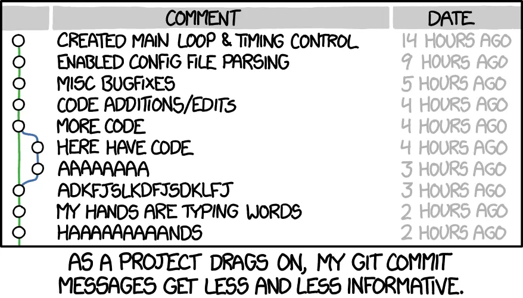
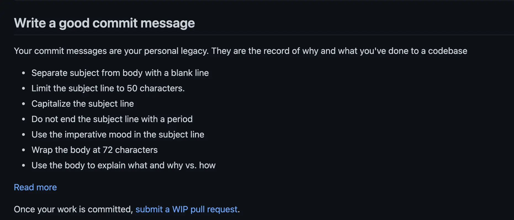

I bumped into an article a few days ago. It was short and simple, related enough to make me wonder if we have the same thing in the team. [How a git commit message should look like.](https://dev.to/i5han3/git-commit-message-convention-that-you-can-follow-1709)



## From the article

The blog post states out what a typical git commit message looks like

```plain_text
<type>(<scope>): <subject>
```

in which

- type: stands for the main action
- scope: stands for the codebase section
- subject: short description on the commit

and

- `type` should follow some key actions: such as `build`,
- `chore`, `feat`, `fix`, `refactor`, ...etc.; while `scope`
- `subject` are optional.

But how optional? My question exactly.

## From the team

We're currently using Outline as the knowledge hub, where every piece of accumulated processes, workflows, document material are stored. I did a round check just to realize we haven't had any notes on the git commit-msg convention.

Working in an IT woodland, GitHub and Git commit -m isn't a new thing, but I never heard of any 'convention.' In fact, I didn't know we _should_. And therefore, I tend to make it with a text, randomly noting down the action I did. For example, if I were writing a new blog post, my commit-msg would likely be

`create-f1` ; `edit-f1` ; `rename-f1` or `finetune-f1`

Since I've mentioned we weren't forced to follow any convention. Sometimes my message would be

`delete-abc-bc-I-was-stoopid` or `oops-Ididitagain`

I pinged a teammate. He's one of the Frontend seniors on the team. As he explained how commit messages convention works in the team, it strikes me that we, in fact, do have a convention. It's based on the type of commit that we're working on.

Each project has its different commits. The commit either affects one part of the project (this is where we use `scope`), or affect the whole project (where `scope` is unnecessary)

Examples for 2 scenarios:

### 1. The commit affects one small scope


- type: fix
- scope: foundation
- subject: ordered list doesn't show numbers

### 2. The commit affects the whole project


- type: chore
- subject: upgrade tailwind and twin.macro

**Which leads me to our current state**
We have a playbook - our guides on getting things done. Here's the old flow we have on git commit message.



and I think it's time to update a new version. Check out our latest update at [dwarvesf/playbook/write-a-good-commit-message](https://github.com/dwarvesf/playbook/blob/master/engineering/git.md#write-a-good-commit-message).
