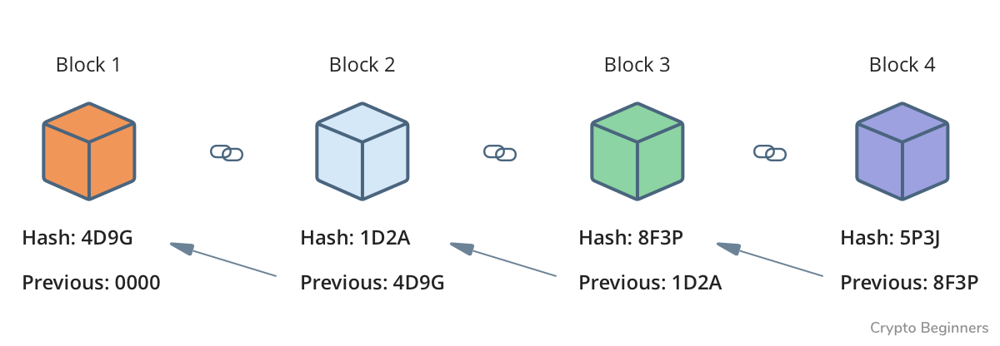
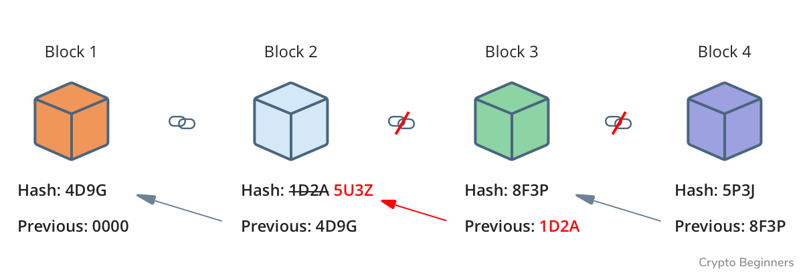
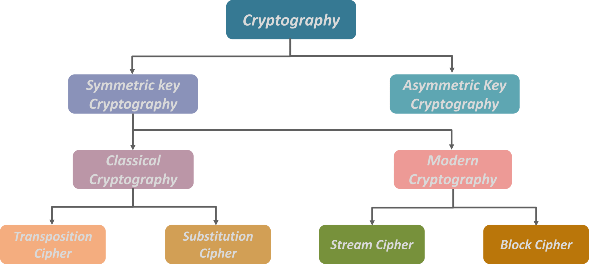
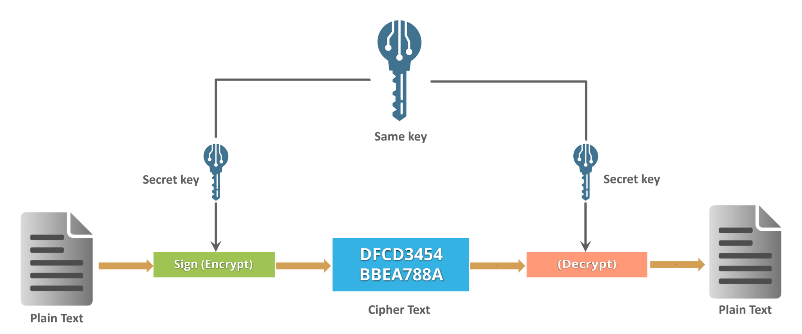
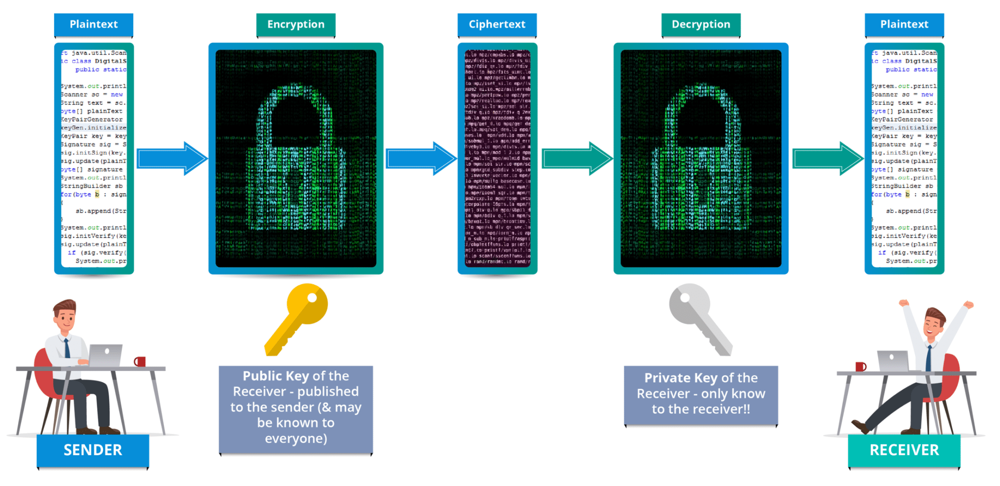

# Blockchain security

## Abstract

This document describes the fundamental theory of blockchain security and provides knowledge to answer a few questions such as **What makes a blockchain system secure ?**, **How is the consensus mechanism implemented ?**, **The role of cryptography in blockchain security**. It also tries to help the reader visualize the way that the blockchain-based system makes to get security.

## Table of Contents

[1. Introduction](#1-introduction)
[2. How does blockchain works](#2-how-does-blockchain-works)
[3. What makes a blockchain system secure](#3-what-makes-a-blockchain-system-secure)
[3a. The most important features](#3a-the-most-important-features)
[3b. Cryptography in blockchain security](#3b-cryptography-in-blockchain-security)
[3b.1 Cryptography techniques](#3b1-cryptography-techniques)
[3b.2 Application of cryptography in blockchain](#3b2-application-of-cryptography-in-blockchain)
[4. Security in popular blockchain consensus protocols](#4-security-in-popular-blockchain-consensus-protocols)
[4a. Proof of Work](#4a-proof-of-work)
[4b. Proof of Stake](#4b-proof-of-stake)
[5. Summary](#5-summary)

---

### 1. Introduction

Blockchain has been growing quickly in the recent 10 years. The use of blockchain technology is being explored in contexts where data immutability and security are highly valuable. If you interested in the technologies under the hood of banking, investing or cryptocurrency, you may be familiar with this concept. Blockchain technology is the underlying structure of most cryptocurrency systems and is what prevents this kind of digital money from being duplicated or destroyed. In short, blockchain is a distributed, decentralized, public ledger.

In other words, in the core, blockchain is not so different from a regular database with a few unique attributes such as:

- Decentralization: No single party has the ability to control what information will be added to the chain.
- Consensus: every party in the Blockchain network must store exact copies of the same ledger, so the majority has to agree on the information being added.
- Add-only: the only action "add" is allowed in the network.
- Public: information in the network can be accessed and replicated by every party.

Blockchain is a good record-keeping system. Many technology experts believe that blockchain is far more secure than other platforms. This memo will provide fundamentals of blockchain security mechanisms and try to visualize it by using a few examples from the real world.

This document's target is making everyone without knowledge about blockchain can understand the way Blockchain-based system is implemented to get security.

### 2. How does blockchain works

Without getting too technical, let’s take a look under the hood and see what’s happened in a Blockchain system.

The first thing that is mentioned in the name of this platform is **block**. Combine this with the concept introduced in [section 1](#1-introduction) that blockchain is not so different from a regular database, we can imagine that Blockchain uses block to store pieces of information. But it is not only one block for storing all data, a lot of blocks is generated and used in the system. Each block is time-stamped and connected to the one generated before it generated time. So a chain of blocks is created, hence the term **blockchain**.

There are usually three types of information is stored in each block:

- Data of transactions: information of payments that occurred on the blockchain network, is packed into a group.
- Previous block's hash: it is usually the previous block's identification that is generated hash function (will be considered in the next section).
- Block's own hash: like previous at nature but far different from value.

Essentially block hash like a block’s fingerprint, it is commonly a unique string of character generated depend on data of transactions, hash of previous block and other factors that are determined by network publishers to fix with their customers and target market.

Take a look at this example, noted that (1) and (2) is the same thing:





We can see above **Block2** contains the hash string of **Block1**, and uses it as a signature to know where is this block located. If **Block1**'s hash is changed, the link will be broken. To make the chain sense again, re-generate hash of Block2 and every block after that is needed. It is usually a hard job.

Depend on the way that blockchain works, there is many features that make blockchain attractive for financial use cases in terms of confidentiality and privacy:

- Avoids the need of midle-man which can reduce transfer cost.
- Supports for digital transactions.
- Easy to share information in the network.

### 3. What makes a blockchain system secure

Description in [section 2](#2-how-does-blockchain-works) is a very simple view about blockchain to help everybody without technical knowledge to get an overview of the blockchain system. In the real-life, blockchain is a complex platform with a variety of properties, theories, algorithms, and mechanisms. A lot of things contribute to building blockchain security that includes advanced cryptographic techniques and mathematical models of behavior and decision-making and this is far from a simple subject. Therefore, this is very important to understand a few basic concepts and mechanisms that make blockchain have robust protection.

#### 3a. The most important features

**Decentralization**

> Copies of the blockchain ledger are stored and updated on each node-computer in the network, meaning that there is no central authority to make decisions.

Almost all systems today are operating into centralization, meaning authorities will be held by a single highest authority in charge of managing systems, such as a central bank, state apparatus, company or event a class. This method helps someone get mastership and ensure the process is methodical from top-down. But this exists several crucial disadvantages such as any malfunction at the top operation has negatives effect on the entire system, stemming from the fact that any central authority also plays the role of a single point of failure in the system. To resolve centralization's disadvantages, a contrast feature is created, called **Decentralization**. This is a process of distributing and dispersing power away from a central authority.

A few advantages of decentralization

- Reduces the burden on top executives
- Facilitates diversification
- Better control and supervision
- Quick Decision-Making

**Consensus**

> The ability of nodes agrees on the true state of the network to ensure that the rules of the system are being followed and all parties involved agree on the current network's state.

In any centralized system, like the company employee management system, a central administrator has the authority to maintain and update the database. In another side, blockchain is a distributed decentralized. There is no single central authority to make a decision about the validity of each transaction. But transactions of the blockchain system is always secured and verified because of consensus mechanisms.

A consensus algorithm is a procedure through which all the peers of the blockchain network reach a common agreement about the present state of a distributed ledger. It establishes trust between unknown peers in the network and ensures that the one and only one truth that is agreed by all the nodes in the blockchain system, is added into the ledger.

There are many consensus protocols in the blockchain:

- Proof of Work (PoW)
- Proof of Stake (PoS)
- Delegated Proof of Stake (DPoS)
- Proof of Important (PoI)
- Proof of Elapsed Time (PoET)

**Immutability**

> Immutable means that something is unchanging over time or unable to be changed.

For example, when I send a message into a group chat on Facebook, it has done. I can't delete or edit it. If I want to delete it, I have to persuade my every friend in this group to delete the message. So I say that it got immutability from my perspective.

In blockchain, it is ability to prevent alteration of confirmed transactions. So that priority guarantees the integrity of data. It also means that transaction records after each newly confirmed block of data to be valid.

#### 3b. Cryptography in blockchain security

##### 3b.1 Cryptography techniques

Before research about the role of cryptography in blockchain security, we need to know what is cryptography and a few popular types of this field.

In short, cryptography is the process converting readable info into unintelligible info and vice-versa. Depend on this characteristic, cryptography has many applications such as storing, transmitting data with benefits on protection and authentication.

Modern cryptography has a few properties:
**Confidentiality**

> Nobody can understand the content of encrypted information.

In detail, confidentiality is the protection of information from unauthorized persons. To implement this characteristic, blockchain using encrypt function that converts readable information to an unreadable format called cipher and ability decryption is only provides for the person who got authorization. It also means that if the information is held in confidence, it will be shared only after authorization is provided, and then only with authorized individuals.

**Integrity**

> The information that is encrypted, can't be altered by anyone.

This is critical respect to the design, implementation, and usage of any system which stores, processes, or retrieves data. Integrity ensures that information is accurate and consistent over its entire life-cycle. The meaning of this concept is very varied depends on the field that applies it. In our context, it is invariability of encrypted information.

**Non-repudiation**

> Sender cannot deny their intentions in the transmission of the information at a later stage.

Non-repudiation is the assurance that nobody can reject the validity of something in the system. In other words, non-repudiation makes the system avoids the ability that a message or information is denied its original location as well as authenticity and integrity. It is widely applied in the information security field to get proof of the origin and the integrity of data.

From the above properties, there are three popular types of cryptography:



- Symmetric-key Cryptography

  > Sender and receiver use the same key to encrypt and decrypt infomations.

  

- Public-Key Cryptography

  > There are two key in this algorithm: public key is freely distributed and use for encrypting infomation, in the other hand, private key is secret and using for decrypting cipher to readable infomation.

  

- Hash Functions
  > No key is used. Information is transferred through a function that has a few properties such as result is a fixed-length string (hash), the same input makes the same output, different input leads to completely different output and output can not be reversed.

##### 3b.2 Application of cryptography in blockchain

To get data security, the blockchain system uses a lot of cryptography algorithms [1]()(#ref1), hash function[2]()(#ref2) mentioned above, are the most popular techniques that are used in this context.

The hash of each block is generated depend on the hash of the previous block's hash. So a chain of linked blocks is generated in the arrangement. Another attribute, affect the value of the block's hash, is data that is stored in the block. We can imagine that the hash is generated by combining the previous block's hash, current block's data and other factors, then we transmit the combination through a hash function to get current block's hash. These hash identifiers play a major role in ensuring blockchain security and immutability.

Blockchain is also use hashing to get consensus in validating transactions. Bitcoin is the best example in this context, using protocols [Proof of Work](#4a-proof-of-work), Bitcoin applies hash function SHA-256 [3]()(#ref3) that takes information input and generates a hash string with 256 bits length or 64 characters long.

Another protection what cryptography provides for blockchain is assurance for the safety of the wallets where cryptocurrency located. [Public-Key Cryptography](#3b1-cryptography-techniques) is used here to encrypt and decrypt payment information when sending and receiving. Private key is also used to generate a digital signature for transactions to get authenticate ownership of the coins that are being sent.

Further information is that the blockchain system uses private key to lock the wallet account and hold it safe until the owner decides to spend them.

### 4. Security in popular Blockchain consensus protocols

Majority of the blockchain system has a lot of things and functions that are implemented in the same way. But one of the functions that blockchains can be unique is the way consensus is reached. So, in this section, we will research how blockchain gets consensus in a few ways, those implementation, application, and interaction of the properties mentioned in [section 3](#3-what-makes-a-blockchain-system-secure) with each other and with consensus mechanism.

#### 4a. Proof of Work

Proof Of Work (POW) is the first blockchain consensus mechanism that is used by Bitcoin. Today, it is being widely used in a lot of cryptocurrencies system to get robust security.

The Proof of Work process makes the blockchain system look like mines, where the nodes in the network can become a miner. Miners use a lot of computational power to try to solve complex mathematical puzzles as fast as possible. If a miner is the first one who solves the puzzle, he gets to create a new block that stores transaction data and receives a reward for this job. These mathematical puzzles have some interesting properties.

- Firstly, the answer to the complex puzzles is very hard to find out. But it's easy to validate that is a correct answer by anyone.

- The only way to find this answer is to **guess** it. It is not possible to solve the puzzles quicker using any other method than trial and error. It is also the reason that this protocol requires a lot of computational power and time, which leads to waste.

- Finally, if blocks are created too fast, the puzzle will become harder, in case that is too slow to solve, it gets easier. Meaning blocks have to be created within a certain time frame. This mechanism helps the system maintain a consistent supply of new coins. In short, the difficulty of puzzles changes depending on how fash blocks are mind.

To understand clearly the above properties of PoW and the way that they interact with each other to get security, let's take Bitcoin (BTC) [4]()(#ref4) as an example.

In the Bitcoin, a few transactions occurred on the network is packed in a block. To identify each block, Bitcoin blockchain system uses a hash string that is generated by using a cryptography hash function. This hash is generated depend on block's stored data, previous block's hash and another factor (in this context, this is a random **nonce** number). We can imagine that the three above properties are combined together and transmitted through a hash function to get the identificational hash string.

Specific example with Bitcoin mechanism


Let's assume a rule in a mining round like following: Miner needs finding a random nonce so that combines it with block's data and previous block's hash together and pass through hash function SHA-256, required result is a hash string starting with 4 zeros. E.x: `0000ankhsdqk12KLwkqLKWK...`.

As you see, this is very easy to verify that a string with 4 zeros at the beginning. In other words, this rule makes easy to reach consensus.

Miner's mission is finding a nonce to make `SHA256(Block's data   Previous block hash Nonce)` return a valid result. This is a hard job and harder in real life. It takes a lot of time and computational power.

Example:

```
Node b:
    Loop 1: Nonce is 0; Hash is lLKNCKNdlsdnvl2930932... => invalid => skip
    Loop 2: Nonce is 1; Hash is 000klqscnnfp101239301... => invalid => skip
    ...
    Loop 1123123: Nonce is 1123124; Hash is 0000lkKACLKASCK122012l... => valid => Broadcast on network to validate by other nodes.

Another node 1: 0000lkKACLKASCK122012l have 4 zeros at beginning => Valid
Another node 2: 0000lkKACLKASCK122012l have 4 zeros at beginning => Valid
...
Another node n: 0000lkKACLKASCK122012l have 4 zeros at beginning => Valid
=> Reached consensus => Get reward
```

Hard to find and easy to verify, this characteristic makes nobody want to do bad things on the network, they can be recognized and rejected by everyone.

Another point is, because hash function makes a completely different result even if a small change at input. If someone wants to change the information in a block, they have to do the change process for this block and the ones after it. So cheating's cost is many times more expensive than the reward.

Besides, remember that the Blockchain network is a decentralized ledger, all of the above steps only change your local ledger. If you want to control the network, you will own 51% of total computational power on the overall network. It is usually impossible because of the competitiveness and magnitude of the network.

#### 4b. Proof of Stake

To get enough computational power, Proof of Work wasted a lot of resources all over the world. So it is said to be unsustainable in the future. A system, was designed to solve some of the inefficiencies and emerging problems that commonly arise on [PoW-based](#4a-proof-of-work) blockchains, is called Proof of Stake (PoS).

In short, PoS is the more environmentally friendly brother of the Proof Of Work (PoW).

Different from PoW that use **Work** to confirm transactions and reach consensus, the PoS system use **Stake** to do the same thing. Meaning it uses the premise that those who own most coins in a network have a vested interest in keeping the network maintained and the value of its coins high. Although the system still uses the cryptographic algorithm in identify, the objective of the mechanism is different.

In the PoS system, instead of concept mining, forging is used to refer to action to validate a block of transactions. Reward now is no longer the coins that were generated when mining but comes from transaction fees. To forge block on the network, a node needs to stake coins into the network. This stake will be lock until this node wants to leave the role forger.

The use of **Stake** makes the PoS network has robust security. In a few cases, it is stronger than PoW consensus because of the constraint of locked coins ( known as security deposits). This is because stake that is bonded by a node which exhibits faulty behavior can be forfeit, or ‘slashed’, by the protocol. The protocol can, therefore, define some strong disincentive, or maximal penalty for incorrect behavior which can potentially far outweigh any transaction fees or mining rewards defined for correct behavior. It is very important to modern, fault-tolerant PoS design, that the major protocols like Tendermint and Casper adopt security deposits at the core of their incentive mechanisms.

Example to make PoS clearly.

Assuming that we have a PoS Blockchain Network. In this network, if you want to be a validator (forger), you need to stake a minimum of 100 coins. Your opportunity of being a forger and winning reward depends on the total percentage of coins you hold compared to the whole system. Take a look at the following example.

- The blockchain has a total of 1000 coins in circulation.
- You purchase and stake 100 coins. This means you have staked 10% of the total coins in circulation.
- You now have a 10% chance of being a validator and get the reward.

### 5. Summary

- Blockchain is a distributed, decentralized, public ledger.
- There are three types of information stored in each block: data of transactions, previous block’s hash and block’s own hash.
- There are three important features that make blockchain secure: immutability, consensus, decentralization.
- Blockchain system security relies on a lot of cryptography algorithms.
- There are three popular types of cryptography: Symmetric-key Cryptography, Public-Key Cryptography, Hash Functions.
- Proof of Word Blockchain gets security by using computational power (Work).
- Proof of Stake Blockchain is secure because of the constraint of locked coins ( known as security deposits - Stake).

## Reference

<a name="ref1">[1]</a> "What is Cryptography? | Cryptographic Algorithms | Types of ...." 20 Dec. 2019, https://www.edureka.co/blog/what-is-cryptography/.

<a name="ref2">[2]</a> "What are Hash Functions and How to choose a good Hash ...." https://www.geeksforgeeks.org/what-are-hash-functions-and-how-to-choose-a-good-hash-function/.

<a name="ref3">[3]</a> "RFC 4634 - US Secure Hash Algorithms (SHA and HMAC-SHA)." https://tools.ietf.org/html/rfc4634.

<a name="ref4">[4]</a> "Bitcoin - Open source P2P money." https://bitcoin.org/.
