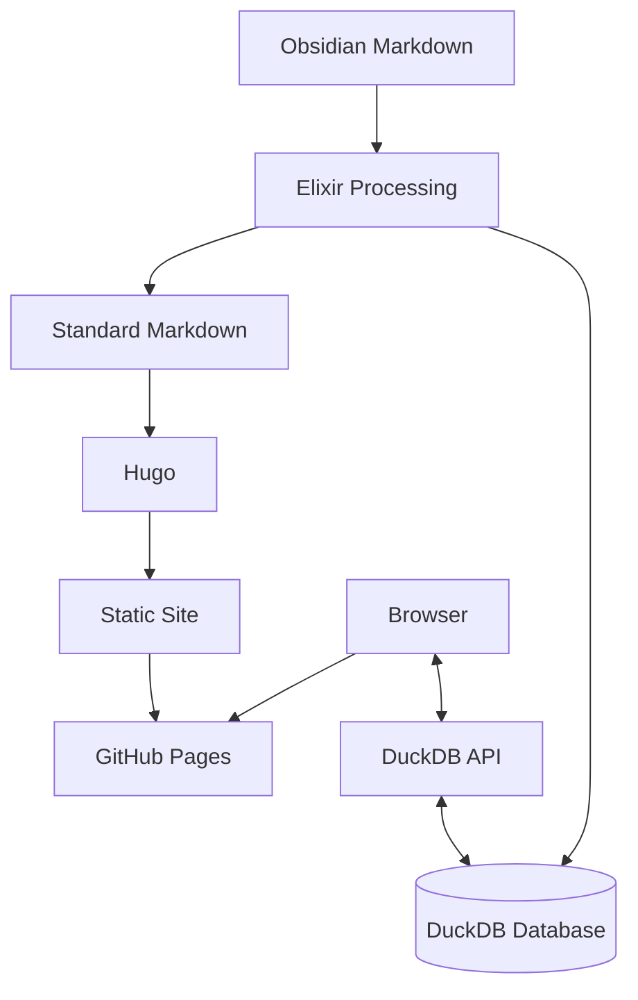

# Dwarves Memo Documentation

This documentation provides a comprehensive overview of the Dwarves Memo architecture, data flow, and technical implementation. It equips developers with essential knowledge about system components, their interactions, and the rationale behind key design decisions.

## System Overview

Dwarves Memo transforms **Obsidian Markdown** content into a searchable static website with powerful discovery features. The system employs a hybrid architecture combining **Static Site Generation** for converting Markdown to HTML using **Hugo**, a **Vector Database** for storing content with embeddings in **DuckDB**, **Client-Side Search** capabilities in the browser, and **API Integration** for enabling database queries from the static site.

## Documentation Structure

The documentation is organized into sections covering system architecture, data flow processes, and key features.

The **Architecture** section includes a [System Overview](architecture/overview.md) detailing the high-level architecture of Dwarves Memo. This document explains system components, their interactions, design principles, technical stack, and system boundaries.

The **Data Flow** section contains two critical documents. The [Data Processing Pipeline](data-flow/pipeline.md) explains content movement through the system, covering **Content Source** selection, **Markdown Processing**, **DuckDB** population, **Hugo** generation, and the deployment process. The [Search System](data-flow/search.md) document details the search functionality implementation, including the **Client-Side Search Interface**, **Vector Embedding** generation, **SQL Query** construction, **API Integration**, and performance optimization techniques.

The **Features** section includes a [DuckDB Integration](features/duckdb-integration.md) document that examines **DuckDB** usage, covering build-time data processing, runtime query system, **Vector Search** capabilities, dynamic content generation, and performance considerations.

## Key Concepts

Several foundational concepts underpin the Dwarves Memo system. **Obsidian Markdown** enhances standard Markdown with **Wikilinks** and embedded content. **Frontmatter** provides YAML metadata at the beginning of Markdown files. **Vector Embeddings** create numerical representations of text that capture semantic meaning. **DuckDB** functions as an in-process analytical database. **Hugo** generates static sites from Markdown content. **Static Sites** deliver content as pre-rendered files without server-side processing. **Client-Side Search** implements search functionality directly in the browser.

## Development Workflow

The Dwarves Memo development workflow follows a sequential process. **Content Creation** begins with writing Markdown in Obsidian. The **Build Process** executes the **Elixir Processing Pipeline**. **Hugo Generation** converts processed Markdown to HTML. **Local Testing** enables site preview before the **Deployment** stage publishes content to **GitHub Pages**.

## Getting Started

New developers should begin with the [Architecture Overview](architecture/overview.md) to understand the high-level system design, then explore the [Data Processing Pipeline](data-flow/pipeline.md) to learn content flow mechanics. Search-focused developers should review the [Search System](data-flow/search.md) document. Database-oriented developers will benefit from the [DuckDB Integration](features/duckdb-integration.md) document covering build-time and runtime database operations.

## Contributing to Documentation

This documentation evolves alongside the codebase. Contributors should place architectural overviews in the `architecture/` directory, data flow descriptions in the `data-flow/` directory, and feature documentation in the `features/` directory. Please update this README.md file when adding new documentation to maintain comprehensive cross-references.

## Conclusion

Dwarves Memo represents a modern approach to content management and discovery, combining **Static Site Generation** benefits with **Vector Search** and database technologies. This documentation provides clear insights into how these technologies integrate to create a seamless user experience.