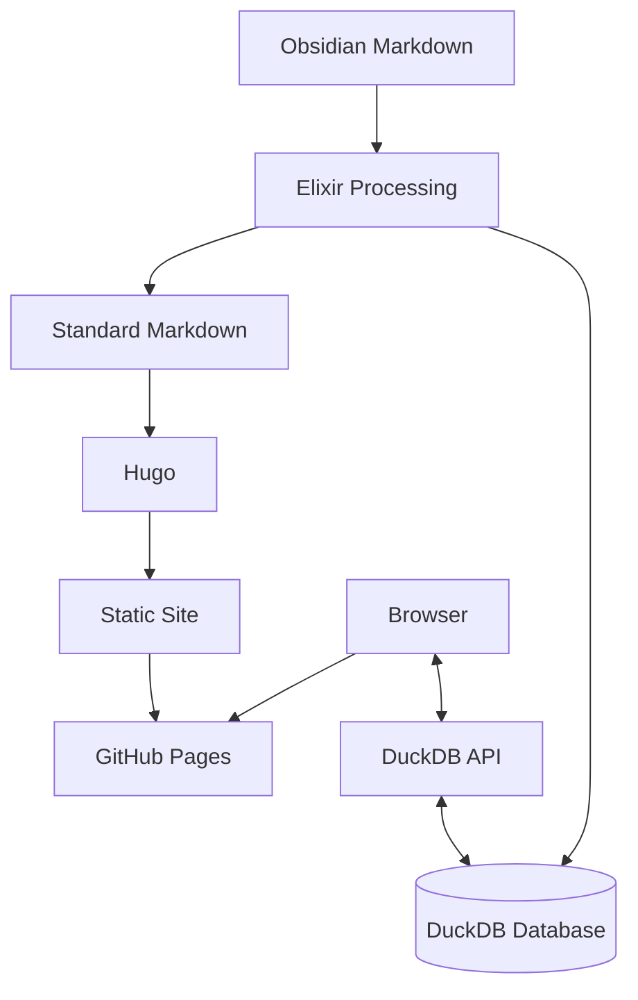

# Architecture Overview

This document provides a high-level overview of the Dwarves Memo architecture.

## System Architecture

Dwarves Memo implements a hybrid architecture that combines static site generation with dynamic search capabilities:

### Key Components

The **Content Authoring** process utilizes **Obsidian** for creating content with its enhanced Markdown syntax. All content resides in a **Git Repository** structure within the `vault/` directory, supporting rich Markdown features including **Wikilinks**, embedded content, and **Frontmatter** metadata.

The **Content Processing** layer employs **Elixir** to transform **Obsidian Markdown** to standard Markdown for **Hugo**. This transformation extracts metadata and content for **DuckDB**, generates **Vector Embeddings** for semantic search, and handles **Slugification**, link resolution, and asset processing.

For **Data Storage**, the system implements **DuckDB** to store content, metadata, and vector embeddings. This enables sophisticated search queries and facilitates efficient export to **Parquet** format for storage and transfer.

The **Static Site Generation** component leverages **Hugo** to convert standard Markdown to HTML, apply themes and layouts, and generate a fully static site ready for deployment.

**Deployment** occurs through **GitHub Pages**, which hosts the static site, provides **CDN** capabilities, and enables collaboration through Git.

The **Search and Discovery** functionality combines client-side UI for search and navigation with a server-side API for executing **DuckDB** queries, delivering vector-based semantic search capabilities.

## Design Principles

### 1. Content-First Approach

The system architecture prioritizes content creation and discovery. This principle manifests through minimal friction for content authors using familiar Markdown, rich metadata through frontmatter, and an emphasis on discoverability and relationships between content pieces.

### 2. Progressive Enhancement

Core functionality operates without JavaScript dependencies. The content remains fully accessible as static HTML, while search features enhance the experience without being required. The system provides graceful degradation when advanced features aren't available.

### 3. Separation of Concerns

The architecture maintains clear boundaries between content creation in **Obsidian**, content processing with **Elixir**, presentation through **Hugo** and CSS, and interaction via JavaScript.

### 4. Performance Optimization

Multiple strategies ensure optimal performance throughout the system. These strategies include static pre-rendering for core content, efficient vector search through **DuckDB**, client-side caching of search results, and optimized asset delivery.

### 5. Extensibility

The system architecture supports extension through custom **Shortcodes** for specialized content, integration with new **Embedding Models**, and pluggable components through clearly defined interfaces.

## Technical Stack

The Dwarves Memo technical stack consists of **Obsidian Markdown** for content authoring, **Elixir** for the build system, **DuckDB** as the analytical database, **Hugo** as the static site generator, **HTML/CSS/JavaScript** for the frontend, custom **Embedding Models** for vector search, **GitHub Pages** for hosting, and **Modal.com** for API hosting.

## System Boundaries

### Internal Systems

The **Markdown Processing Pipeline** converts Obsidian Markdown to Hugo-compatible Markdown. The **Embedding Generation** system creates vector embeddings for content. The **Database Management** component handles DuckDB operations and exports.

### External Dependencies

The system relies on the **OpenAI API** for generating high-quality embeddings (optional), **Modal.com** for hosting the DuckDB query API, **GitHub Pages** for hosting the static site, and **Transformers.js** for client-side machine learning for embeddings.

## Next Steps

For detailed information about specific components of the architecture, you can explore the [Data Pipeline](../data-flow/pipeline.md) documentation which details the data processing pipeline implementation. The [Search System](../data-flow/search.md) document provides comprehensive documentation of the search architecture. For an in-depth examination of DuckDB usage, refer to the [DuckDB Integration](../features/duckdb-integration.md) document.