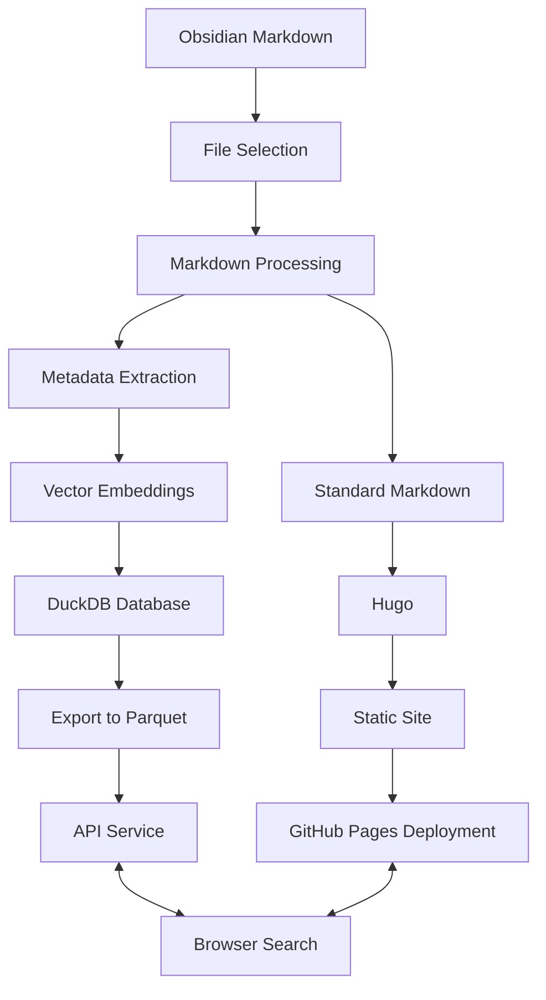

# Data Processing Pipeline

This document describes the data processing pipeline that transforms content from Obsidian Markdown to a Hugo-compatible static site with search capabilities.

## Overview

The Dwarves Memo data pipeline implements a multi-step process that transforms raw **Obsidian Markdown** into both **Hugo**-compatible Markdown and a searchable database. The pipeline architecture supports incremental updates, ensuring that only changed content undergoes processing.



## Pipeline Steps

### 1. Content Source

The pipeline begins with **Obsidian Markdown** files located in the `vault/` directory. These files contain rich content with Obsidian-specific syntax, **Frontmatter** metadata, **Wikilinks**, Obsidian embeds, and other custom syntax elements.

### 2. File Selection

The system identifies processing candidates through several mechanisms. It selects new or modified files since the last build using **Git** change detection, files matching specific patterns via wildcards, or all files during a full rebuild operation.

```elixir
# From export_duckdb.ex
defp get_files_to_process(directory, commits_back, all_files, pattern) do
  files = case commits_back do
    :all ->
      all_files
    _ ->
      git_files = GitUtils.get_modified_files(directory, commits_back)
      # Additional code for submodules...
  end
  
  if pattern do
    pattern_files = Path.wildcard(Path.join(directory, pattern))
    Enum.filter(files, &(&1 in pattern_files))
  else
    files
  end
end
```

### 3. Parallel Processing Streams

The system processes content through two parallel streams to optimize throughput and resource utilization.

#### Stream A: Markdown Conversion for Hugo

The **Frontmatter Validation** process checks for required metadata fields and extracts frontmatter and content body. **Link Processing** extracts and resolves wikilinks, converts them to standard Markdown links, and slugifies paths for web URLs. **DuckDB Query Processing** handles custom `dsql-table` and `dsql-list` code blocks by executing queries against DuckDB and replacing blocks with query results as Markdown. **Asset Handling** copies and processes asset folders while slugifying asset paths and filenames. The final output writes processed Markdown to the `content/` directory while maintaining directory structure with appropriate slugification.

#### Stream B: DuckDB Database Population

**Content Preparation** extracts frontmatter metadata and prepares content for embedding. **Embedding Generation** creates vector embeddings using the OpenAI embedding API for high-quality embeddings and local custom embeddings for efficiency, while also creating summarized content (SPR). **Database Storage** stores metadata, content, and embeddings in DuckDB, implements efficient upsert operations, and handles deleted files. **Database Export** exports the database to **Parquet** format and cleans up the schema for deployment.

### 4. Hugo Static Site Generation

**Hugo** processes the standard Markdown to generate a static site. It applies themes and layouts, processes shortcodes, generates HTML, CSS, and JavaScript, and creates index files for navigation.

### 5. DuckDB API Service

A separate **API Service** hosted on **Modal.com** provides SQL query execution against the DuckDB database, vector similarity search capabilities, and result formatting and delivery.

### 6. Deployment

The static site deploys to **GitHub Pages**, while DuckDB Parquet files deploy to the API service. Client-side JavaScript connects to the API to enable search functionality.

## Incremental Processing Logic

A key feature of the pipeline is intelligent incremental processing that optimizes resource usage:

```elixir
# From export_duckdb.ex
defp maybe_update_database(existing_data, frontmatter, md_content) do
  case existing_data do
    [] ->
      insert_or_update_new_document(frontmatter, md_content)

    _ ->
      if escape_multiline_text(existing_data["md_content"]) != escape_multiline_text(md_content) or
           is_nil(existing_data["spr_content"]) or
           is_nil(existing_data["embeddings_openai"]) or
           is_nil(existing_data["embeddings_spr_custom"]) do
        insert_or_update_new_document(frontmatter, md_content)
      else
        use_existing_embeddings(existing_data, frontmatter)
      end
  end
end
```

This logic processes new documents completely, while for existing documents it regenerates embeddings and updates the database when content changes, reuses existing embeddings when only metadata changes, and skips processing entirely when nothing has changed.

## Custom Syntax Processing

The system handles several types of custom syntax to maintain compatibility between Obsidian and Hugo.

### Wikilinks

The system converts Obsidian wikilinks to standard Markdown links. For example, `[[Some Page]]` becomes `[Some Page](/some-page/)`.

### DuckDB Queries

The pipeline processes custom DuckDB query blocks into Markdown tables:

```markdown
```dsql-table
SELECT title, description FROM vault WHERE tags @> ARRAY['AI'] LIMIT 5
```
```

### Frontmatter Metadata

The system preserves and processes YAML frontmatter:

```yaml
---
title: Example Document
tags: [documentation, architecture]
authors: [jane-doe]
date: 2023-01-15
---
```

This metadata serves dual purposes: it remains preserved for Hugo's use in the Markdown output and gets extracted and stored in structured form in DuckDB.

## Performance Considerations

The pipeline implements several performance optimizations to ensure efficient processing. **Parallel Processing** utilizes Elixir's Flow for concurrent file processing and handles Markdown conversion and database updates simultaneously. **Incremental Updates** process only changed files and reuse existing embeddings when possible. **Efficient Storage** employs Parquet format for compact vector storage and implements efficient upsert operations. **Caching** implements client-side caching of search results and server-side query optimization.

## Error Handling

The pipeline includes robust error handling mechanisms. **File Validation** checks for required frontmatter before processing and skips files that don't meet requirements. **Query Protection** safely handles DuckDB query execution errors and provides informative error messages in the output. **Graceful Degradation** falls back to alternatives when features aren't available and delivers helpful error messages.

## Conclusion

The data processing pipeline transforms Obsidian Markdown into both a static site and a searchable database. This hybrid approach combines the benefits of static site generation (speed, simplicity, security) with the power of a queryable database (search, filtering, relationships).