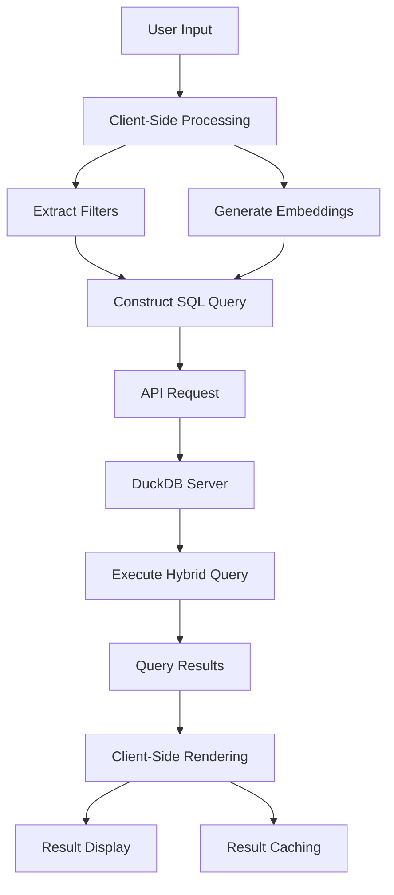

# Search System Architecture

This document explains the hybrid search architecture implemented in Dwarves Memo, combining full-text search with vector similarity for powerful content discovery.

## Overview

Dwarves Memo implements a sophisticated search system that combines traditional keyword-based search with modern vector-based semantic search. This hybrid approach provides relevant results even when exact keywords don't match, while maintaining the performance and simplicity benefits of a static site.



## Components

### 1. Client-Side Search Interface

The search system begins with the **Command Palette** interface, implemented in `layouts/partials/command-palette.html`. The interface activates through keyboard shortcuts (⌘+K) and provides real-time search as users type. The system extracts filters for structured search, categorizes results with previews, and implements client-side caching for performance optimization.

### 2. Filter Extraction

The system parses structured search filters from natural language queries:

```javascript
const parseQueryForFilters = (query) => {
  const filters = { authors: [], tags: [], title: "" }
  const stripFilters = query.split(" ").filter(token => {
    const titleMatch = [...token.matchAll(titleRe)];
    const authorMatch = [...token.matchAll(authorRe)];
    if (authorMatch?.length) {
      filters.authors = filters.authors.concat(authorMatch.map(m => m[1]));
      return false;
    }
    const tagMatch = [...token.matchAll(tagRe)];
    if (tagMatch?.length) {
      filters.tags = filters.tags.concat(tagMatch.map(m => m[1]));
      return false;
    }
    if (titleMatch?.length) {
      filters.title = titleMatch[0][1];
      return false;
    }
    return true;
  })
  return { filters, query: stripFilters.join(" ").trim() };
}
```

This functionality enables users to search with special syntax patterns. Users can find content by a specific author using `author:jane`, locate content with specific tags via `tag:documentation`, or search for content with particular words in the title through `title:architecture`.

### 3. Vector Embedding Generation

For semantic search capabilities, the system generates **Vector Embeddings** of the search query:

```javascript
const queryEmbeddings = await window.getEmbeddings(query);
```

This functionality is implemented using **Transformers.js**, which loads and runs a machine learning model directly in the browser:

```javascript
queueMicrotask(async () => {
  // Don't load these models on mobile
  if (window.innerWidth <= 768) {
    return;
  }

  // Load transformers.js otherwise
  try {
    console.time(`Initializing transformers.js pipeline with ${transformersEmbeddingsModel}`);

    env.backends.onnx.wasm.wasmPaths = "https://fastly.jsdelivr.net/npm/@xenova/transformers@2.17.1/dist/";
    window.pipe = await pipeline('feature-extraction', transformersEmbeddingsModel);

    console.timeEnd(`Initializing transformers.js pipeline with ${transformersEmbeddingsModel}`);
  } catch (error) {
    console.warn('Failed to initialize pipeline:', error);
  }
})
```

The system utilizes `Snowflake/snowflake-arctic-embed-l` as the embedding model, which provides an optimal balance of quality and performance for browser-based execution.

### 4. SQL Query Construction

The system constructs a sophisticated **SQL Query** combining both filter parameters and vector similarity:

```javascript
const queryStr = `
  SELECT
    title,
    description,
    file_path,
    tags,
    md_content,
    spr_content,
    fts_main_vault.match_bm25(file_path, '${query}') AS full_text_score,
    ${queryEmbeddings ? `array_cosine_similarity(${JSON.stringify(Array.from(queryEmbeddings.data))}::FLOAT[1024], embeddings_spr_custom)` : "1"} AS similarity
  FROM vault
  WHERE
    embeddings_spr_custom IS NOT NULL
    AND title IS NOT NULL
    ${filters.title ? `AND title ILIKE '%${filters.title}%'` : ""}
    AND tags IS NOT NULL
    ${filters.tags.length ? `AND tags @> '${JSON.stringify(filters.tags)}'::jsonb` : ""}
    AND (NOT hiring OR hiring IS NULL)
    AND (NOT draft OR draft IS NULL)
    ${filters.authors.length ? `AND authors @> '${JSON.stringify(filters.authors)}'::jsonb` : ""}
  ORDER BY
    full_text_score DESC,
    similarity DESC
  LIMIT 10;
`;
```

This query selects content and metadata from the vault table while calculating a **BM25** full-text search score and a vector similarity score using **Cosine Similarity**. It applies filters for tags, authors, and title, excludes hiring and draft content by default, orders results by both full-text and similarity scores, and limits results to 10 items for performance optimization.

### 5. API Integration

The query is sent to a server-side API for execution:

```javascript
const queryAPI = async (sql) => {
  try {
    const response = await fetch('https://dwarvesf--quack-serve.modal.run', {
      method: 'POST',
      headers: {
        'Content-Type': 'application/json',
      },
      body: JSON.stringify({ sql }),
    });

    if (!response.ok) {
      throw new Error(`HTTP error! status: ${response.status}`);
    }

    return await response.json();
  } catch (error) {
    console.error('Error querying API:', error);
    throw error;
  }
};
```

This **API Service** accepts SQL queries as JSON payloads, executes them against the **DuckDB** database, returns results as JSON, and runs on **Modal.com** for scalability.

### 6. Result Processing

The search results undergo processing before display:

```javascript
const searchResults = hybridSearchParsedData.map((row) => {
  const filePaths = row.file_path.split("/");
  filePaths.pop();
  row.category = filePaths.join(" > ");
  row.matchingLines = getMatchingLines(
    row.md_content,
    query.split(" ").join("|")
  );
  row.spr_content = row.spr_content?.replaceAll("\n", "<hr />");

  delete row.md_content;
  return row;
});
```

This processing extracts a category from the file path, finds and highlights matching lines in the content, formats content for display, and removes the full content to reduce payload size.

### 7. Result Grouping and Display

Results are grouped by category and displayed to the user:

```javascript
const grouped = _groupBy(searchResults, "category");
const result = {
  grouped,
  flat: Object.values(grouped).flatMap((groupFiles) => groupFiles),
};
```

The UI renders these grouped results with category headers, result titles and descriptions, highlighted matching content, and a preview panel for the selected result.

### 8. Result Caching

To improve performance, search results are cached in the browser's session storage:

```javascript
// Check if the query is in cache
const cachedResult = sessionStorage.getItem(rawQuery);
if (cachedResult) {
  console.log("Retrieving results from cache");
  const parsedResult = JSON.parse(cachedResult);
  dispatchSearchResults(parsedResult);
  return;
}

// Cache the result
sessionStorage.setItem(rawQuery, JSON.stringify(result));
```

This caching mechanism avoids redundant API calls for repeated searches, improves perceived performance, and persists only for the current browser session.

## Search Flow

The complete search flow follows a systematic process. The user activates the search by pressing ⌘+K or clicking the search button, which displays the command palette with search input focused. As the user types a search query, the input is debounced to prevent excessive API calls, and the query is parsed for filters and keywords. During query processing, the system checks the cache for existing results, generates vector embeddings if not cached, constructs an SQL query with filters and embeddings, and sends the query to the API. The result retrieval process executes the query against DuckDB, returns results to the client, processes and groups the results, and stores them in cache. Finally, the results display in grouped categories, allowing the user to navigate with keyboard or mouse, view detailed previews of selected results, and click to navigate to the content.

## Technical Implementation Details

### DuckDB Extensions for Search

The system leverages several **DuckDB Extensions** to enable advanced search capabilities. The **Full-Text Search** functionality uses the `fts_main_vault.match_bm25` function, implements the BM25 ranking algorithm (similar to Elasticsearch), and provides relevance scoring for keyword matches. The **Vector Similarity** functionality uses `array_cosine_similarity` for vector comparisons, normalizes vectors for consistent results, and combines with full-text scores for hybrid ranking.

### Database Schema Design for Search

The database schema is optimized for search performance:

```sql
CREATE TABLE vault(
  file_path VARCHAR, 
  md_content VARCHAR, 
  tags VARCHAR[], 
  title VARCHAR, 
  -- Other metadata fields
  embeddings_openai FLOAT[1536], 
  embeddings_spr_custom FLOAT[1024],
  spr_content VARCHAR,
  -- Additional fields
);
```

Key features include vector embeddings stored as float arrays, array types for tags and authors for efficient filtering, full content storage for context and highlighting, and summarized content (spr_content) for previews.

### Progressive Enhancement

The search system implements **Progressive Enhancement** principles. Basic content browsing functions without JavaScript, while search features become available when JavaScript is enabled. Mobile devices avoid loading the embedding model to conserve resources, and an offline fallback displays a message when the API is unavailable.

## Future Improvements

The search system roadmap includes several planned enhancements. **WASM-based DuckDB** will run DuckDB directly in the browser via WebAssembly, enable offline search capabilities, and reduce API dependencies. **Enhanced Query Understanding** will implement natural language query parsing, query expansion for better results, and spelling correction with suggestions. **Personalized Results** will learn from user interactions, prioritize recently viewed content, and adapt to user interests. **Performance Optimizations** will introduce precomputed results for common queries, improved vector quantization for faster similarity calculations, and optimized model loading and execution.

## Conclusion

The hybrid search system combines the best of traditional full-text search with modern vector-based semantic search, all while maintaining the benefits of a static site architecture. This approach provides powerful discovery capabilities without sacrificing performance or simplicity.