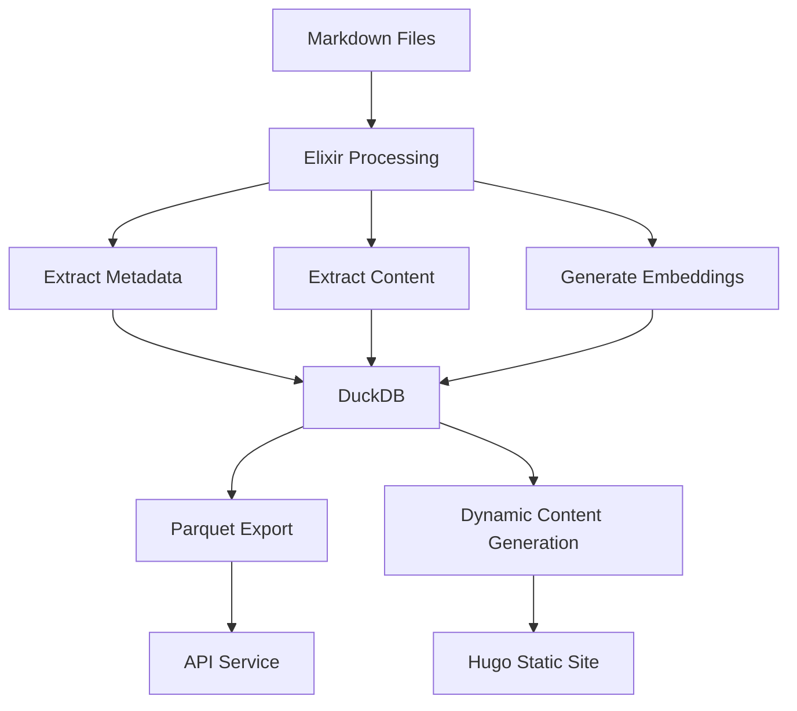

# DuckDB Integration

This document describes how DuckDB is integrated into the Dwarves Memo system, both during the build process and at runtime.

## Introduction to DuckDB

[DuckDB](https://duckdb.org/) is an in-process analytical database system, designed to execute analytical SQL queries while being embeddable within applications. In Dwarves Memo, **DuckDB** serves as both a build-time data processing and storage engine and a runtime query engine for search and content discovery. This hybrid usage pattern enables powerful data processing capabilities without the complexity of a traditional client-server database.

## DuckDB in the Build Pipeline

### Role During Compilation

During the build process, **DuckDB** performs several critical functions. It stores structured content metadata extracted from frontmatter, indexes full content for search and discovery, stores embeddings for semantic search capabilities, and executes queries to generate dynamic content.



### Implementation Details

The DuckDB integration is implemented primarily in the `Memo.ExportDuckDB` module. Key components include:

#### Database Initialization

```elixir
defp setup_database() do
  check_query = "SELECT table_name FROM information_schema.tables WHERE table_name = 'vault'"

  case DuckDBUtils.execute_query(check_query) do
    {:ok, []} ->
      case DuckDBUtils.execute_query("IMPORT DATABASE 'db'") do
        {:ok, _} ->
          IO.puts("Successfully imported database from 'db' directory.")
          merge_columns()

        {:error, error} ->
          IO.puts("Failed to import database: #{error}")
          create_vault_table()
      end

    {:ok, _} ->
      merge_columns()

    {:error, error} ->
      IO.puts("Error checking for vault table: #{error}")
      create_vault_table()
  end
end
```

This initialization code checks if the vault table already exists, attempts to import the database from the 'db' directory if it doesn't, creates a new vault table if import fails, and merges any new columns into the existing schema.

#### Schema Design

The schema is designed to store both content and metadata:

```elixir
@allowed_frontmatter [
  {"file_path", "TEXT UNIQUE"},
  {"md_content", "TEXT"},
  {"spr_content", "TEXT"},
  {"embeddings_openai", "FLOAT[1536]"},
  {"embeddings_spr_custom", "FLOAT[1024]"},
  {"title", "VARCHAR"},
  {"short_title", "VARCHAR"},
  {"description", "VARCHAR"},
  {"tags", "VARCHAR[]"},
  {"authors", "VARCHAR[]"},
  # Additional metadata fields...
]
```

This schema uses array types for tags, authors, and embeddings, stores both full content and summarized content, includes multiple embedding types (**OpenAI** and custom), and maintains complete metadata from frontmatter.

#### Content Processing

For each Markdown file, the system extracts frontmatter and content, generates embeddings for the content, and stores everything in **DuckDB**.

```elixir
defp process_and_store(file_path, frontmatter, md_content) do
  escaped_file_path = escape_string(file_path)

  normalized_frontmatter = frontmatter
  |> Map.update("tags", [], fn tags ->
    # Normalize tags...
  end)

  query = "SELECT spr_content, md_content, embeddings_openai, embeddings_spr_custom FROM vault WHERE file_path = '#{escaped_file_path}'"

  case DuckDBUtils.execute_query(query) do
    {:ok, result} ->
      existing_data = List.first(result) || []
      transformed_frontmatter = transform_frontmatter(md_content, normalized_frontmatter, file_path)
      maybe_update_database(existing_data, transformed_frontmatter, md_content)

    {:error, error_message} ->
      IO.puts("Query failed: #{inspect(error_message)}")
  end
end
```

#### Incremental Updates

The system optimizes for incremental builds through intelligent processing logic:

```elixir
defp maybe_update_database(existing_data, frontmatter, md_content) do
  case existing_data do
    [] ->
      insert_or_update_new_document(frontmatter, md_content)

    _ ->
      if escape_multiline_text(existing_data["md_content"]) != escape_multiline_text(md_content) or
           is_nil(existing_data["spr_content"]) or
           is_nil(existing_data["embeddings_openai"]) or
           is_nil(existing_data["embeddings_spr_custom"]) do
        insert_or_update_new_document(frontmatter, md_content)
      else
        use_existing_embeddings(existing_data, frontmatter)
      end
  end
end
```

This logic processes new documents completely from scratch, regenerates embeddings for changed documents, and reuses existing embeddings for unchanged documents to save processing time.

#### Database Export

After processing, the database is exported to **Parquet** format:

```elixir
defp export(format) do
  case format do
    "csv" ->
      response = DuckDBUtils.execute_query("EXPORT DATABASE 'db'")
      clean_exported_schema("db/schema.sql")
      response

    "parquet" ->
      response = DuckDBUtils.execute_query("EXPORT DATABASE 'db' (FORMAT PARQUET)")
      clean_exported_schema("db/schema.sql")
      response

    _ ->
      IO.puts("Unsupported export format: #{format}")
  end
end
```

This export creates Parquet files for efficient storage and transfer, maintains a SQL schema file for reference, and cleans up the schema file to remove system schemas.

## Dynamic Content Generation

### DuckDB-Powered Markdown Blocks

**DuckDB** powers dynamic content generation within Markdown files through custom code blocks:

```markdown
```dsql-table
SELECT title, description FROM vault WHERE tags @> ARRAY['AI'] LIMIT 5
```
```

These blocks undergo processing during the Markdown conversion phase. The system identifies `dsql-table` and `dsql-list` code blocks, executes the enclosed SQL query against DuckDB, converts the results to Markdown tables or lists, and replaces the code block with the generated Markdown. This enables dynamic content generation based on the content database, such as related article lists, content category tables, featured posts based on metadata, and statistics and summaries.

## Runtime Query System

### API Service

At runtime, **DuckDB** continues to power the system through an API service:

```javascript
const queryAPI = async (sql) => {
  try {
    const response = await fetch('https://dwarvesf--quack-serve.modal.run', {
      method: 'POST',
      headers: {
        'Content-Type': 'application/json',
      },
      body: JSON.stringify({ sql }),
    });

    if (!response.ok) {
      throw new Error(`HTTP error! status: ${response.status}`);
    }

    return await response.json();
  } catch (error) {
    console.error('Error querying API:', error);
    throw error;
  }
};
```

This **API Service** accepts arbitrary SQL queries, executes them against the DuckDB database (loaded from Parquet), returns JSON results, and is hosted on **Modal.com** for scalability.

### Client-Side Integration

The client-side JavaScript initializes a connection to the API:

```javascript
// Initialize search
dispatchSearchPlaceholder('Initializing Search...');
queryAPI('SELECT 1')
  .then(() => {
    console.log('API connection successful');
    dispatchSearchPlaceholder('Search');
  })
  .catch((error) => {
    console.error('Failed to initialize API connection:', error);
    dispatchSearchPlaceholder('Search (Offline)');
  });
```

### Hybrid Search Queries

The system combines full-text and vector search through sophisticated SQL queries:

```javascript
const queryStr = `
  SELECT
    title,
    description,
    file_path,
    tags,
    md_content,
    spr_content,
    fts_main_vault.match_bm25(file_path, '${query}') AS full_text_score,
    array_cosine_similarity(${JSON.stringify(Array.from(queryEmbeddings.data))}::FLOAT[1024], embeddings_spr_custom) AS similarity
  FROM vault
  WHERE
    embeddings_spr_custom IS NOT NULL
    AND title IS NOT NULL
    ${filters.title ? `AND title ILIKE '%${filters.title}%'` : ""}
    AND tags IS NOT NULL
    ${filters.tags.length ? `AND tags @> '${JSON.stringify(filters.tags)}'::jsonb` : ""}
    AND (NOT hiring OR hiring IS NULL)
    AND (NOT draft OR draft IS NULL)
    ${filters.authors.length ? `AND authors @> '${JSON.stringify(filters.authors)}'::jsonb` : ""}
  ORDER BY
    full_text_score DESC,
    similarity DESC
  LIMIT 10;
`;
```

This query leverages DuckDB's capabilities for full-text search with **BM25** ranking, vector similarity using cosine distance, array containment operators for tag and author filtering, and hybrid ranking combining multiple relevance signals.

## Vector Search Capabilities

### Embedding Storage

**DuckDB** stores vector embeddings in two formats: **OpenAI Embeddings** as 1536-dimensional vectors from the OpenAI API and **Custom Embeddings** as 1024-dimensional vectors from a local model.

```sql
-- Schema excerpt
embeddings_openai FLOAT[1536],
embeddings_spr_custom FLOAT[1024],
```

### Vector Similarity Functions

**DuckDB** provides built-in functions for vector operations:

```sql
-- Cosine similarity between query vector and stored embeddings
array_cosine_similarity([0.1, 0.2, ...], embeddings_spr_custom) AS similarity
```

These functions enable semantic search based on meaning rather than keywords, ranking by similarity to query, and finding related content.

### Hybrid Ranking

Results undergo ranking using a combination of signals:

```sql
ORDER BY
  full_text_score DESC,
  similarity DESC
```

This hybrid approach combines traditional keyword relevance (**BM25** score) with semantic relevance (vector similarity) to ensure the most relevant results appear first.

## Performance Considerations

### Query Optimization

Several techniques optimize query performance. The **Limit Clause** restricts results to a small set (usually 10), **Filtering Before Ranking** applies filters before computing expensive similarity scores, and **Progressive Loading** loads basic results first, then enhances with details.

### Parquet Format Benefits

Using **Parquet** as the storage format provides several advantages. Its **Column-Oriented Storage** enables efficiency for analytical queries that access specific columns. **Compression** reduces storage requirements and transfer times. **Schema Evolution** supports changes to the schema over time. **Type Preservation** maintains array types and other complex data structures.

### Client-Side Caching

To reduce API load, search results undergo caching:

```javascript
// Check if the query is in cache
const cachedResult = sessionStorage.getItem(rawQuery);
if (cachedResult) {
  console.log("Retrieving results from cache");
  const parsedResult = JSON.parse(cachedResult);
  dispatchSearchResults(parsedResult);
  return;
}

// Cache the result
sessionStorage.setItem(rawQuery, JSON.stringify(result));
```

## Future Enhancements

### Planned DuckDB Improvements

Several enhancements to the DuckDB integration are planned. **WebAssembly Integration** will run DuckDB directly in the browser via WASM, enable offline search capabilities, and reduce API dependencies. **Advanced Query Features** will implement multi-vector queries for more nuanced search, time-based relevance scoring, and user preference personalization. **Enhanced Schema** will add additional metadata fields for better filtering, hierarchical tag structures, and content relationship modeling.

## Conclusion

**DuckDB** serves as a versatile component in the Dwarves Memo architecture, providing a powerful data processing engine during builds, a flexible query system at runtime, support for both traditional and vector-based search, and efficient storage and retrieval of content and metadata. This hybrid approach combines the benefits of traditional relational databases with modern vector search capabilities, all within a static site architecture.